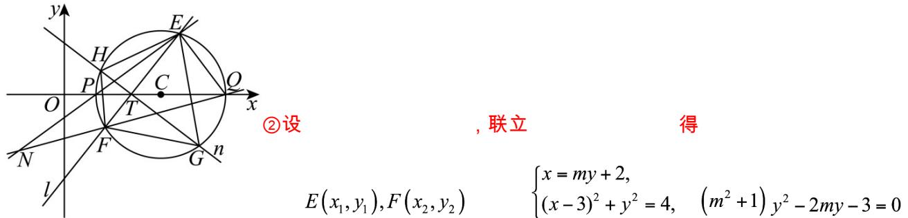

> [!faq]- 《第二章_直线和圆的方程_高效培优讲义_》官方解析
>
> > [!success]- **【答案】** (1) $(x-3)^{2}+y^{2}=4$ (2)① 7 ; ②证明见解析
>
> > [!note]- **【解析】**
> > （1）设动点 $M$ 的坐标为 $(x,y)$ ，因为 $S(-1,0), T(2,0)$ ，且 $|MS| = 2 |MT|$
> >
> > 所以 $\sqrt{(x+1)^{2}+y^{2}}=2\sqrt{(x-2)^{2}+y^{2}}$
> >
> > 整理得 $x^{2} + y^{2} - 6x + 5 = 0$ ，即 $(x - 3)^{2} + y^{2} = 4$ ，
> >
> > 所以动点 $M$ 的轨迹 $C$ 的方程为 $(x - 3)^2 + y^2 = 4$
> >
> > (2) ①如图，因为直线 l 不与 x 轴重合，所以设直线 l 的方程为 $x = my + 2$ ，
> >
> > 即 $x - my - 2 = 0$ ，则直线 $GH$ 的方程为 $mx + y - 2m = 0$ ：
> >
> > 由（1）知轨迹 $C$ 为圆，圆 $C$ 的半径为 $r = 2$ ，
> >
> > 设圆 C 的圆心 $C(3,0)$ 到直线 l 和直线 GH 的距离分别为 $d_{1}, d_{2}$
> >
> > $$
> > d _ {1} = \frac {1}{\sqrt {1 + m ^ {2}}}, d _ {2} = \frac {| m |}{\sqrt {m ^ {2} + 1}}
> > $$
> >
> > $$
> > \text {所以} \left| E F \right| = 2 \sqrt {r ^ {2} - d _ {1} ^ {2}} = 2 \sqrt {4 - \frac {1}{1 + m ^ {2}}} = 2 \sqrt {\frac {4 m ^ {2} + 3}{m ^ {2} + 1}}, \left| G H \right| = 2 \sqrt {r ^ {2} - d _ {2} ^ {2}} = 2 \sqrt {4 - \frac {m ^ {2}}{m ^ {2} + 1}} = 2 \sqrt {\frac {3 m ^ {2} + 4}{m ^ {2} + 1}}
> > $$
> >
> > $$
> > S _ {\text {四边形} E G F H} = \frac {1}{2} | E F | | G H | = \frac {1}{2} \times 2 \sqrt {\frac {4 m ^ {2} + 3}{m ^ {2} + 1}} \times 2 \sqrt {\frac {3 m ^ {2} + 4}{m ^ {2} + 1}} = 2 \sqrt {1 2 + \frac {m ^ {2}}{m ^ {4} + 2 m ^ {2} + 1}}
> > $$
> >
> > $$
> > \text {当} m = 0 _ {\text {时}}, S _ {\text {四边形} E G F H} = 4 \sqrt {3}
> > $$
> >
> > $$
> > \text {当} _ {m \neq 0} \text {时,} S _ {\text {四边形} E G F H} = 2 \sqrt {1 2 + \frac {1}{m ^ {2} + 2 + \frac {1}{m ^ {2}}}} \leq 2 \sqrt {1 2 + \frac {1}{2 + 2 \sqrt {m ^ {2} \cdot \frac {1}{m ^ {2}}}}} = 7,
> > $$
> >
> > 当且仅当 $m^2 = 1$ 时等号成立.
> >
> > 综上所述，四边形 EGFH 面积的最大值为 7.
> >
> > 
> >
> > 则 $y_{1} + y_{2} = \frac{2m}{m^{2} + 1},y_{1}y_{2} = \frac{-3}{m^{2} + 1},y_{1}y_{2} = -\frac{3}{2m}\left(y_{1} + y_{2}\right)$
> >
> > 因为曲线 C 与 x 轴交于 P，Q 两点，所以不妨取 $P(1,0)$ ， $Q(5,0)$ （如图），
> >
> > 则直线 $PE$ 的方程为 $y = \frac{y_1}{x_1 - 1} (x - 1) = \frac{y_1}{my_1 + 1} (x - 1)$
> >
> > 直线 $QF$ 的方程为 $y = \frac{y_2}{x_2 - 5} (x - 5) = \frac{y_2}{my_2 - 3} (x - 5)$
> >
> > 联立两直线方程得
> >
> > $$
> > x = \frac {4 m y _ {1} y _ {2} + 3 y _ {1} + 5 y _ {2}}{3 y _ {1} + y _ {2}} = \frac {- 6 y _ {1} - 6 y _ {2} + 3 y _ {1} + 5 y _ {2}}{3 y _ {1} + y _ {2}} = \frac {- 3 y _ {1} - y _ {2}}{3 y _ {1} + y _ {2}} = - 1
> > $$
> >
> > 所以 N 在定直线 x = -1 上，得证。
