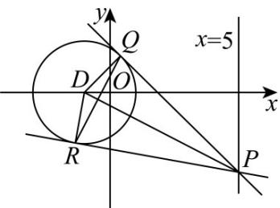

> [!faq]- 《第二章_直线和圆的方程_高效培优讲义_》官方解析
>
> > [!success]- **【答案】** (1) $(x+1)^{2}+y^{2}=4$ ，曲线 $\Gamma$ 是以 $(-1,0)$ 为圆心，2为半径的圆. (2) $\left[2\sqrt{2},4\right]$ (3)证明见解析，定点 $\left(-\frac{1}{3},0\right)$
>
> > [!note]- **【解析】**
> > （1）设 $M(x,y)$ ，由 $\frac{|MA|}{|MB|} = \frac{1}{2}$ ，得 $\frac{\sqrt{(x + 1)^2 + (y - 1)^2}}{\sqrt{(x + 1)^2 + (y - 4)^2}} = \frac{1}{2}$
> >
> > 化简得 $x^{2} + y^{2} + 2x - 3 = 0$ ，即 $(x + 1)^{2} + y^{2} = 4$ ，
> >
> > 故曲线 $\Gamma$ 是以 $(-1,0)$ 为圆心，2 为半径的圆。
> >
> > (2) 设圆 $C: (x + 1)^2 + y^2 = 4$ ，将点 $N(0,1)$ 代入圆 $C$ 的方程等号左侧，得 $(0 + 1)^2 + 1^2 = 2 < 4$
> >
> > 故点 $N(0,1)$ 在圆 C 的内部.
> >
> > 设圆心 C 到直线 EF 的距离为 d，所以 $\left|EF\right|=2\sqrt{4-d^{2}}$
> >
> > 又 $N(0,1)$ ， $C(-1,0)$ ，所以 $d \leq |CN| = \sqrt{2}$ ，所以 $|EF| = 2\sqrt{4 - 2} = 2\sqrt{2}$
> >
> > 当直线 $EF$ 过圆心时， $\left|EF\right| = 4$ ，此时 $\left|EF\right|$ 最大，
> >
> > 故 $|EF|$ 的取值范围为 $\left[2\sqrt{2},4\right]$
> >
> > (3) 如图，由题意知，PQ, PR 与圆相切，Q, R 为切点，
> >
> > 则 $DQ \perp PQ$ ， $DR \perp PR$ ，则 $D, R, P, Q$ 四点共圆，且 $R, Q$ 在以 $DP$ 为直径的圆上，
> >
> > 因为 $D(-1,0)$ ， $P(5,p)$ ，所以 $DP$ 的中点为 $\left(2,\frac{p}{2}\right)$ ， $|DP| = \sqrt{36 + p^2}$
> >
> > 以线段 DP 为直径的圆的方程为 $\left(x-2\right)^{2}+\left(y-\frac{p}{2}\right)^{2}=\frac{36+p^{2}}{4}$
> >
> > 整理得， $x^{2}+y^{2}-4x-py-5=0$ ，①
> >
> > 又 Q, R 在曲线 $\Gamma: x^{2} + y^{2} + 2x - 3 = 0$ ②上，
> > - **②**：-①，得 $6x + py + 2 = 0$ ，所以直线 $QR$ 的方程为 $6x + py + 2 = 0$
> >
> > 当 $y = 0$ 时， $x = -\frac{1}{3}$ ，则直线 $QR$ 恒过定点 $\left(-\frac{1}{3}, 0\right)$
> >
> > <!-- source-part:3 pages:101-101 -->
> >
> > 
