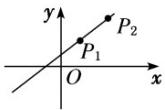
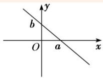

## 知识点 01 直线的倾斜角和斜率

## 1. 倾斜角的定义

当直线 l 与 x 轴相交时，取 x 轴作为基准，x 轴正向与直线 l 向上的方向之间所成的角 $\alpha$ 叫做直线 l 的倾斜角．如图所示，直线 l 的倾斜角是 $\angle APx$ ，直线 $l'$ 的倾斜角是 $\angle BPx$ .

## 2. 倾斜角的范围

直线的倾斜角 $\alpha$ 的取值范围是 $0^{\circ} \leq \alpha < 180^{\circ}$ ，并规定与 $x$ 轴平行或重合的直线的倾斜

为 $0^{\circ}$

注：①每一条直线都有一个确定的倾斜角

②已知直线上一点和该直线的倾斜角，可以唯一确定该直线

3. 斜率的定义

一条直线的倾斜角 $\alpha$ 的正切值叫做这条直线的斜率．常用小写字母 $k$ 表示，即 $k = \tan \alpha (\alpha \neq 90^{\circ})$

4. 斜率公式

经过两点 $P_{1}(x_{1},y_{1})$ ， $P_{2}(x_{2},y_{2})(x_{1}\neq x_{2})$ 的直线的斜率公式为 $k = .$ 当 $x_{1} = x_{2}$ 时，直线 $P_{1}P_{2}$ 没有斜率.【即学即练】

1. 设直线 $l$ 的方程为 $x - y\cos \theta + 2 = 0$ ，则直线 $l$ 的倾斜角 $\alpha$ 的取值范围是（）A. $[0, \pi]$ B. $\left[\frac{\pi}{4}, \frac{\pi}{2}\right]$ C. $\left[\frac{\pi}{4}, \frac{3\pi}{4}\right]$ D. $\left[\frac{\pi}{4}, \frac{\pi}{2}\right) \cup \left(\frac{\pi}{2}, \frac{3\pi}{4}\right]$

【答案】C

【详解】当 $\cos\theta=0$ 时，直线 l 的方程为 x=-2 ，此时直线 l 的倾斜角 $\alpha=\frac{\pi}{2}$ ；

当 $\cos \theta \neq 0$ 时，直线 $l$ 的斜率为 $\tan \alpha = \frac{1}{\cos \theta}$

因为 $\cos \theta \in [-1,0)\cup (0,1]$

所以 $\frac{1}{\cos\theta}\in (-\infty , - 1]\cup [1, + \infty)$ ，即 $\tan \alpha \in (-\infty , - 1]\cup [1, + \infty)$

又因为 $\alpha \in [0,\pi)$

所以结合正切函数的图象可得： $\alpha \in \left[\frac{\pi}{4},\frac{\pi}{2}\right)\cup \left(\frac{\pi}{2},\frac{3\pi}{4}\right]$

综上可得：直线 $l$ 的倾斜角 $\alpha$ 的取值范围是 $\left[\frac{\pi}{4},\frac{3\pi}{4}\right]$

故选：C.

2. 已知点 $A(2, -3)$ 、 $B(-3, -2)$ ，若过定点 $P(1, 1)$ 的直线 $l$ 与线段 $AB$ 相交，则直线 $l$ 的斜率 $k$ 的取值范围是（）A. $(- \infty, -4] \cup \left[\frac{3}{4}, +\infty\right)$ B. $\left[-4, \frac{3}{4}\right]$ C. $\left(\frac{1}{5}, +\infty\right)$ D. $\left[-\frac{3}{4}, 4\right]$

【答案】A

【详解】设过点 P 且垂直于 x 轴的直线交线段 AB 于点 E，如下图所示：

$$
k _ {P A} = \frac {1 + 3}{1 - 2} = - 4
$$

$$
k _ {P B} = \frac {1 + 2}{1 + 3} = \frac {3}{4}
$$

当直线 l 从 PB 的位置旋转至与 PE 的位置靠近时，
此时直线 l 的倾斜角逐渐增大，且为锐角，则 $k \quad k_{PB} = \frac{3}{4}$ ；
当直线 l 从靠近 PE 的位置旋转至 PA 的位置时，
此时直线 l 的倾斜角逐渐增大，且为钝角，则 $k \leq k_{PA} = -4$ .
综上所述，直线 l 的斜率 k 的取值范围是 $(-\infty, -4] \cup \left[\frac{3}{4}, +\infty\right)$

故选：A.

知识点 02 直线的五种方程

<table><tr><td>名称</td><td>条件</td><td>方程</td><td>图形</td><td>适用范围</td></tr><tr><td>点斜式</td><td>直线1过定点 $P(x_0,y_0)$ ,斜率为k</td><td> $y - y_0 = k(x - x_0)$ </td><td></td><td>不表示垂直于x轴的直线</td></tr><tr><td>斜截式</td><td>直线1的斜率为k,且与y轴的交点为(0,b)(直线1与y轴的交点(0,b)的纵坐标b叫做直线1在y轴上的截距)</td><td> $\underline{y = kx + b}$ </td><td></td><td>不表示垂直于x轴的直线</td></tr><tr><td>两点式</td><td> $P_1(x_1,y_1)$ 和 $P_2(x_2,y_2)$ 其中 $x_1 \neq x_2$ , $y_1 \neq y_2$ </td><td>=</td><td></td><td>不表示垂直于坐标轴的直线</td></tr><tr><td>截距式</td><td>在x轴上截距a,在y轴上截距b</td><td>+=1</td><td></td><td>不表示垂直于坐标轴的直线及过原点的直线</td></tr><tr><td>一般式</td><td>A,B,C为系数</td><td>Ax+By+C=0( $A^2+B^2 \neq 0$ )</td><td></td><td>任何位置的直线</td></tr></table>
