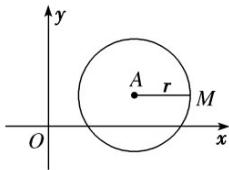

## 知识点 06 圆的方程

## 一、圆的标准方程

1. 圆的定义：平面上到定点的距离等于定长的点的集合叫做圆，定点称为圆心，定长称为圆的半径。

2．圆的要素：是圆心和半径，圆心确定圆的位置，半径确定圆的大小．如图所示．

3. 圆的标准方程：圆心为 $A(a, b)$ ，半径长为 $r$ 的圆的标准方程是 $(x - a)^2 + (y - b)^2 = r^2$ . 当 $a = b = 0$ 时，方程为 $x^2 + y^2 = r^2$ ，表示以原点为圆心、半径为 $r$ 的圆。

## 二、圆的标准方程

## 1. 圆的一般方程的概念

当 $D^2 + E^2 - 4F > 0$ 时，二元二次方程 $x^2 + y^2 + Dx + Ey + F = 0$ 叫做圆的一般方程。

注：将方程 $x^{2} + y^{2} + Dx + Ey + F = 0$ ，配方可得 ${ }^{2} + { }^{2} =$ ，当 $D^2 + E^2 - 4F > 0$ 时，方程 $x^{2} + y^{2} + Dx + Ey + F = 0$ 表示圆．当 $D^2 + E^2 - 4F = 0$ 时，方程 $x^{2} + y^{2} + Dx + Ey + F = 0$ ，表示一个点.

## 2. 圆的一般方程对应的圆心和半径

圆的一般方程 $x^{2} + y^{2} + Dx + Ey + F = 0(D^{2} + E^{2} - 4F > 0)$ 表示的圆的圆心为，半径长为。

注：圆的一般方程表现出明显的代数结构形式，其方程是一种特殊的二元二次方程，圆心和半径长需要代数运算才能得出，且圆的一般方程 $x^{2} + y^{2} + Dx + Ey + F = 0$ （其中 $D, E, F$ 为常数)具有以下特点：

(1) $x^{2}$ ， $y^{2}$ 项的系数均为1；

(2)没有 $xy$ 项；

(3) $D^{2}+E^{2}-4F>0.$

## 3. 常见圆的方程的设法

<table><tr><td></td><td>标准方程的设法</td><td>一般方程的设法</td></tr><tr><td>圆心在原点</td><td> $x^{2} + y^{2} = r^{2}$ </td><td> $x^{2} + y^{2} - r^{2} = 0$ </td></tr><tr><td>过原点</td><td> $(x - a)^{2} + (y - b)^{2} = a^{2} + b^{2}$ </td><td> $x^{2} + y^{2} + Dx + Ey = 0$ </td></tr><tr><td>圆心在x轴上</td><td> $(x - a)^{2} + y^{2} = r^{2}$ </td><td> $x^{2} + y^{2} + Dx + F = 0$ </td></tr><tr><td>圆心在y轴上</td><td> $x^{2} + (y - b)^{2} = r^{2}$ </td><td> $x^{2} + y^{2} + Ey + F = 0$ </td></tr><tr><td>与x轴相切</td><td> $(x - a)^{2} + (y - b)^{2} = b^{2}$ </td><td> $x^{2} + y^{2} + Dx + Ey + D^{2} = 0$ </td></tr><tr><td>与y轴相切</td><td> $(x - a)^{2} + (y - b)^{2} = a^{2}$ </td><td> $x^{2} + y^{2} + Dx + Ey + E^{2} = 0$ </td></tr></table>

4. 二元二次方程 $Ax^2 + Bxy + Cy^2 + Dx + Ey + F = 0$ 表示圆，则

5. 以 $A(x_{1}, y_{1}), B(x_{2}, y_{2})$ 为直径端点的圆的方程为 $(x - x_{1})(x - x_{2}) + (y - y_{1})(y - y_{2}) = 0$ .
