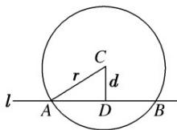

## 知识点 07 直线与圆的位置关系

## 一、直线与圆的位置关系及判断

<table><tr><td colspan="2">位置关系</td><td>相交</td><td>相切</td><td>相离</td></tr><tr><td rowspan="2">判定方法</td><td>几何法:设圆心到直线的距离d=</td><td> $d < r$ </td><td>d=r</td><td>d&gt;r</td></tr><tr><td>代数法:由消元得到一元二次方程的判别式Δ</td><td>Δ&gt;0</td><td>Δ=0</td><td>Δ&lt;0</td></tr></table>

## 二、直线与圆相交的相关问题

## 1. 解决圆的弦长问题的方法

<table><tr><td>几何法(常用)</td><td>如图所示,设直线l被圆C截得的弦为AB,圆的半径为r,圆心到直线的距离为d,则有关系式: |AB| = 2</td></tr><tr><td>代数法</td><td>若斜率为k的直线与圆相交于A(xA,yA),B(xB,yB)两点,则|AB|=·=·|yA-yB|(其中k≠0).特别地,当k=0时,|AB|=|xA-xB|;当斜率不存在时,|AB|=|yA-yB|注:直线l: Ax+By+C=0;圆Mx2+y2+Dx+Ey+F=0联立{Ax+By+C=0x2+y2+Dx+Ey+F=0消去“”得到关于“”的一元二次函数ax2+bx+c=0,结合韦达定理可得到xA+xB,xAXB</td></tr></table>

2．当直线与圆相交时，半径、半弦、弦心距所构成的直角三角形(如图中的 Rt△ADC)，在解题时要注意把它和点到直线的距离公式结合起来使用．

3. 设圆心到直线的距离为 $d$ ，圆的半径为 $r$ ；当直线与圆相交时，圆上的点到直线的最大距离为 $d + r$ ，最小距离为 0

## 三、直线与圆相切的相关问题

1. 求过某点的圆的切线问题时，应首先确定点与圆的位置关系，再求切线方程。若点在圆上（即为切点），则过该点的切线只有一条；若点在圆外，则过该点的切线有两条，此时应注意切线斜率不存在的情况。（注：过圆内一点，不能作圆的切线）

## 2. 求过圆上的一点 $(x_0, y_0)$ 的切线方程的方法

先求切点与圆心连线的斜率 $k$ ，若 $k$ 不存在，则结合图形可直接写出切线方程为 $y = y_0$ ；若 $k = 0$ ，则结合图形可直接写出切线方程为 $x = x_0$ ；若 $k$ 存在且 $k \neq 0$ ，则由垂直关系知切线的斜率为 -，由点斜式可写出切线方程。

## 3. 求过圆外一点 $(x_0, y_0)$ 的圆的切线方程的方法

<table><tr><td>几何法</td><td>当斜率存在时,设为k,则切线方程为 $y - y_0 = k(x - x_0)$ ,即 $kx - y + y_0 - kx_0 = 0$ .由圆心到直线的距离等于半径,即可求出k的值,进而写出切线方程</td></tr><tr><td>代数法</td><td>当斜率存在时,设为k,则切线方程为 $y - y_0 = k(x - x_0)$ ,即 $y = kx - kx_0 + y_0$ ,代入圆的方程,得到一个关于x的一元二次方程,由 $\Delta = 0$ ,求得k,切线方程即可求出</td></tr></table>

## 4. 圆的切线方程常用结论

(1)过圆 $x^{2} + y^{2} = r^{2}$ 上一点 $P(x_{0}, y_{0})$ 的圆的切线方程为 $x_{0}x + y_{0}y = r^{2}$ .

(2)过圆 $(x - a)^{2} + (y - b)^{2} = r^{2}$ 上一点 $P(x_0, y_0)$ 的圆的切线方程为 $\underline{(x_0 - a)(x - a)} + (y_0 - b)(y - b) = r^2$ .

(3)过圆 $x^{2} + y^{2} = r^{2}$ 外一点 $M(x_0,y_0)$ 作圆的两条切线，则两切点所在直线方程为 $\underline{x_0x + y_0y = r^2}$

5.切线长公式

记圆 $C:(x - a)^2 +(y - b)^2 = r^2$ ；过圆外一点 $P$ 做圆 $C$ 的切线，切点为 $H$ ，利用勾股定理求 $PH$ ； $PH = \sqrt{PC^2 - CH^2}$

6. 设圆心到直线的距离为 $d$ ，圆的半径为 $r$ ；当直线与圆相切时，圆上的点到直线的最大距离为 $2r$ ，最小距离为 0

## 四、直线与圆相离的相关问题

设圆心到直线的距离为 $d$ ，圆的半径为 $r$ ；当直线与圆相离时，圆上的点到直线的最大距离为 $d + r$ ，最小距离为 $d - r$ ；

【即学即练】

1. 已知圆 $C: x^2 + y^2 - 2x + 4y + 1 = 0$ 的圆心在直线 $ax - by - 1 = 0$ 上，则 $ab$ 的取值范围是（）A. $\left(-\infty, \frac{1}{4}\right]$ B. $\left(-\infty, \frac{1}{8}\right]$ C. $\left(0, \frac{1}{4}\right]$ D. $\left(0, \frac{1}{8}\right]$

【答案】B

【详解】法一：由题设 $C:(x-1)^{2}+(y+2)^{2}=4$ ，故圆心 $C(1,-2)$

因为圆心 $C$ 在直线 $ax - by - 1 = 0$ 上，所以 $a + 2b - 1 = 0$ ，即 $a = 1 - 2b$

因为 $ab=(1-2b)b=-2b^{2}+b=-2\left(b-\frac{1}{4}\right)^{2}+\frac{1}{8}$

所以当 $b=\frac{1}{4}$ 时，ab 有最大值 $\frac{1}{8}$ ，即 ab 的取值范围为 $\left(-\infty,\frac{1}{8}\right]$ ;

法二：因为圆心 $C$ 在直线 $ax - by - 1 = 0$ 上，所以 $a + 2b - 1 = 0$ ，即 $a + 2b = 1$

又因为 $ab = \frac{1}{2} a\cdot (2b)\leq \frac{1}{2}\cdot \left(\frac{a + 2b}{2}\right)^2 = \frac{1}{8}$ ，当且仅当 $\left\{ \begin{array}{ll}a = 2b\\ a + 2b = 1 \end{array} \right.$ ，即 $\left\{ \begin{array}{ll}a = \frac{1}{2}\\ b = \frac{1}{4} \end{array} \right.$ 时取等号.

故选：B

2. 经过点 $\left(0,0\right)$ ，半径为 2 的圆的圆心为 $A$ ，则点 $A$ 到直线 $x-y+2=0$ 的距离最大值为（）
A. $\sqrt{2}$ B. $2+\sqrt{2}$ C. $2-\sqrt{2}$ D. $3\sqrt{2}$

【答案】B

【详解】已知圆经过点 $(0,0)$ ，半径为2，设圆心A的坐标为 $(x,y)$

可得圆心A到点 $(0,0)$ 的距离为2，

即 $\sqrt{(x - 0)^2 + (y - 0)^2} = 2$ ，化简可得 $x^{2} + y^{2} = 4$

所以圆心A的轨迹是以原点 $(0,0)$ 为圆心，2为半径的圆.

可得原点 $(0,0)$ 到直线 $x - y + 2 = 0$ 的距离为： $d_0 = \frac{|0 - 0 + 2|}{\sqrt{1^2 + (-1)^2}} = \sqrt{2}$

所以点A到直线 $x - y + 2 = 0$ 的距离最大值为原点到直线的距离加上圆的半径，即 $d_{\mathrm{max}} = \sqrt{2} + 2$
