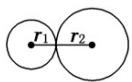
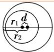
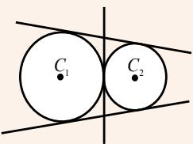
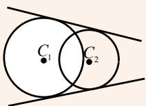
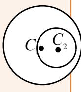

## 知识点 08 圆与圆的位置关系

## 一、圆与圆位置关系的判定

1. 种类：圆与圆的位置关系有五种，分别为外离、外切、相交、内切、内含。

2. 判定方法

(1)几何法：若两圆的半径分别为 $r_1, r_2$ ，两圆连心线的长为 $d$ ，则两圆的位置关系的判断方法如下：

<table><tr><td>位置关系</td><td>外离</td><td>外切</td><td>相交</td><td>内切</td><td>内含</td></tr><tr><td>图示</td><td></td><td></td><td></td><td></td><td></td></tr><tr><td>d与r1,r2的关系</td><td>d&gt;r1+r2</td><td>d=r1+r2</td><td>|r1-r2| &lt; d &lt; r1+r2</td><td>d=|r1-r2|</td><td>d&lt;|r1-r2|</td></tr></table>

(2)代数法：设两圆的一般方程为

$$
C _ {1}: x ^ {2} + y ^ {2} + D _ {1} x + E _ {1} y + F _ {1} = 0 (D + E - 4 F _ {1} > 0),
$$

$$
C _ {2}: x ^ {2} + y ^ {2} + D _ {2} x + E _ {2} y + F _ {2} = 0 (D + E - 4 F _ {2} > 0),
$$

联立方程得则方程组解的个数与两圆的位置关系如下：

<table><tr><td>方程组解的个数</td><td>2 组</td><td>1 组</td><td>0 组</td></tr><tr><td>两圆的公共点个数</td><td>2 个</td><td>1 个</td><td>0 个</td></tr><tr><td>两圆的位置关系</td><td>相交</td><td>内切或外切</td><td>外离或内含</td></tr></table>

## 二、圆与圆位置关系的应用

设圆 $C_1: x^2 + y^2 + D_1x + E_1y + F_1 = 0$ ，①

圆 $C_2: x^2 + y^2 + D_2x + E_2y + F_2 = 0$ ，②

若两圆相交，则有一条公共弦，由①-②，得

$$
(D _ {1} - D _ {2}) x + (E _ {1} - E _ {2}) y + F _ {1} - F _ {2} = 0. \tag {③}
$$

方程③表示圆 $C_1$ 与 $C_2$ 的公共弦所在直线的方程.

(1)当两圆相交时，两圆方程相减，所得的直线方程即两圆公共弦所在的直线方程，这一结论的前提是两圆相交，如果不确定两圆是否相交，两圆方程相减得到的方程不一定是两圆的公共弦所在的直线方程。

(2)两圆公共弦的垂直平分线过两圆的圆心.

(3)求公共弦长时，几何法比代数法简单易求.

## 两圆公共弦长的求法

两圆公共弦长，在其中一圆中，由弦心距 $d$ ，半弦长，半径 $r$ 所在线段构成直角三角形，利用勾股定理求解.

## 三、圆与圆的公切线

## 1、公切线的条数

与两个圆都相切的直线叫做两圆的公切线，圆的公切线包括外公切线和内公切线两种。

<table><tr><td>两圆外离</td><td>两圆外切</td><td>两圆相交</td><td>两圆内切</td><td>两圆内含</td></tr><tr><td>有2条外公切线和2条内公切线,共4条</td><td>有2条外公切线和1条内公切线,共3条;</td><td>只有2条外公切线</td><td>只有1条外公切线</td><td>无公切线</td></tr><tr><td></td><td></td><td></td><td></td><td></td></tr></table>

## 2、公切线的方程

核心技巧：利用圆心到切线的距离 $d = r$ 求解

【即学即练】

1．已知点 $A(-3,0)$ ， $B(3,0)$ ，若圆 $(x-a+1)^{2}+(y-a-2)^{2}=1$ 上存在点 M 满足 $MA \cdot MB = -5$ ，则实数 a 的值
不可能为（）A.2 B.1 C.0 D.-2

【答案】A

【详解】设 $M(x,y)$ ，因为 $\overline{MA} \cdot \overline{MB} = -5$ ， $\overline{MA} = (-3 - x, -y)$ ， $\overline{MB} = (3 - x, -y)$

所以 $\stackrel{\square\square\square\square}{MA}\cdot\stackrel{\square\square\square\square}{MB}=\left(-3-x\right)\times\left(3-x\right)+\left(-y\right)^{2}=x^{2}-9+y^{2}=-5$ ，即 $x^{2}+y^{2}=4$

所以点 M 的轨迹是圆，方程为 $x^{2} + y^{2} = 4$ .

由题意知，圆 $x^{2} + y^{2} = 4$ 与圆 $(x - a + 1)^{2} + (y - a - 2)^{2} = 1$ 有公共点，

所以 $2 - 1 \leq \sqrt{(a - 1)^2 + (a + 2)^2} \leq 2 + 1$ ，解得 $-2 \leq a \leq 1$

故A不满足.

故选：A.

2．若圆 $O_{1}:x^{2}+y^{2}-4y=0$ ，圆 $O_{2}:x^{2}+y^{2}-6x-4y+4=0$ 的两交点分别为 A，B，则 $|AB|=(\quad)$ A. $\frac{2\sqrt{5}}{3}$ B. $\frac{8\sqrt{2}}{3}$ C. $\frac{2\sqrt{2}}{3}$ D. $\frac{8\sqrt{5}}{3}$

【答案】B

【详解】方法一 将两圆的方程作差，可得 $x=\frac{2}{3}$ ，即直线 AB 的方程为 $x=\frac{2}{3}$ ，圆 $O_{1}$ 的圆心为 $O_{1}(0,2)$ ，半径为 2，
则 $O_{1}$ 到直线 $x=\frac{2}{3}$ 的距离为 $\frac{2}{3}$ ，故 $\left|AB\right|=2\sqrt{2^{2}-\left(\frac{2}{3}\right)^{2}}=\frac{8\sqrt{2}}{3}$ 方法二 联立 $\left\{\begin{aligned}x^{2}+y^{2}-4y=0,\\ x^{2}+y^{2}-6x-4y+4=0,\end{aligned}\right.$ 解得 $\left\{\begin{aligned}x=\frac{2}{3},\\ y=\frac{6+4\sqrt{2}}{3}\end{aligned}\right.$ 或 $\left\{\begin{aligned}x=\frac{2}{3},\\ y=\frac{6-4\sqrt{2}}{3},\end{aligned}\right.$ 所以 $\left|AB\right|=\frac{6+4\sqrt{2}}{3}-\frac{6-4\sqrt{2}}{3}=\frac{8\sqrt{2}}{3}$

故选：B.
