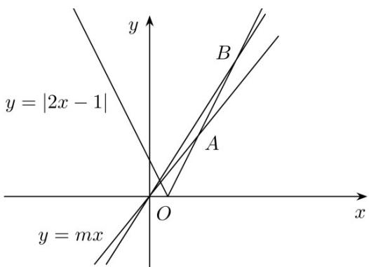

> [!faq]- 《第二章_直线和圆的方程_高效培优讲义_》官方解析
>
> > [!success]- **【答案】** A
>
> > [!note]- **【解析】**
> > $f(x)>0$ 得 $mx>\left|2x-1\right|$ ，所以满足 $f(x)>0$ 的整数解恰有3个，等价于函数 $y=\left|2x-1\right|$ 的图象在直线
> > y = mx
> > 下方的部分有3个整点.
> >
> > 如图，当直线 y = mx 的斜率 m 满足 $k_{OA} < m \leq k_{OB}$ 时满足题意，其中 $A(3,5), B(4,7)$
> >
> > 所以， $k_{OA}=\frac{5}{3},k_{OB}=\frac{7}{4}$ ，所以 $\frac{5}{3}<m\leq\frac{7}{4}$ .
> >
> > 故选：A
> >
> > 
