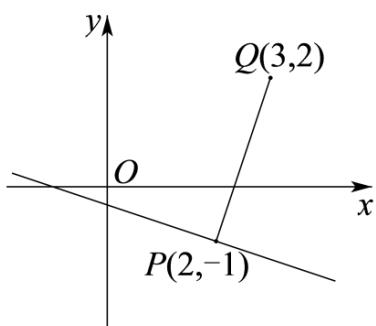

> [!faq]- 《第二章_直线和圆的方程_高效培优讲义_》官方解析
>
> > [!success]- **【答案】** D
>
> > [!note]- **【解析】**
> > 
> >
> > 由 $\lambda x + y - 2\lambda +1 = 0$ 得 $\lambda (x - 2) + y + 1 = 0$
> >
> > 由 $\left\{\begin{aligned}x-2&=0\\ y+1&=0\end{aligned}\right.$ 得 $\left\{\begin{aligned}x&=2\\ y&=-1\end{aligned}\right.$ ，故直线 $\lambda x+y-2\lambda+1=0$ 过定点 $P(2,-1)$ .
> >
> > 记点 $(3,2)$ 为点 $Q$ ，当 $PQ$ 与直线 $\lambda x + y - 2\lambda + 1 = 0$ 垂直时，点 $(3,2)$ 到直线 $\lambda x + y - 2\lambda + 1 = 0$ 的距离有最大值，最大值为 $|PQ| = \sqrt{(3 - 2)^2 + (2 + 1)^2} = \sqrt{10}$ .
> >
> > 故选 **D**.
