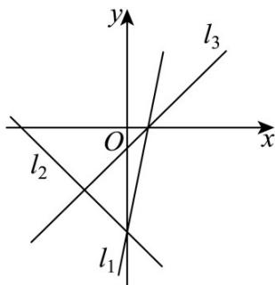

## 题型04 直线的交点坐标和距离问题

【典例1】设 $a$ 为实数，若直线 $l_{1}:ax + y + 1 = 0$ ， $l_{2}:x + y + 1 = 0$ ， $l_{3}:(a^{2} + a - 5)x + 3ay - 3 = 0$ 两两相交，且交点恰为直角三角形的三个顶点，则这样的 $l_{1}$ ， $l_{2}$ ， $l_{3}$ 有（）A.2组 B.3组 C.4组 D.5组

【答案】B

【详解】由题设， $l_{1}, l_{2}, l_{3}$ 的方向向量分别为 $m_{1} = (1, -a)$ ， $m_{2} = (1, -1)$ ， $m_{3} = (3a, -a^{2} - a + 5)$

若 $l_{1} \perp l_{2}$ ，则 $m_{1} \cdot m_{2} = (1, -a) \cdot (1, -1) = 1 + a = 0 \Rightarrow a = -1$

此时 $l_{1}:-x+y+1=0$ ， $l_{2}:x+y+1=0$ ， $l_{3}:-5x-3y-3=0$ ，它们交于一点 $(0,-1)$ ，不符；

若 $l_{1} \perp l_{3}$ ，则 $\overline{m_1} \cdot \overline{m_3} = (1, -a) \cdot (3a, -a^2 - a + 5) = a(a^2 + a - 2) = 0 \Rightarrow a = -2$ 或 $a = 0$ 或 $a = 1$ 。

当 $a = -2$ 时， $l_{1}:-2x+y+1=0$ ， $l_{2}:x+y+1=0$ ， $l_{3}:x+2y+1=0$ ，满足题设；

当 a=0 时， $l_{1}:y+1=0$ ， $l_{2}:x+y+1=0$ ， $l_{3}:-5x-3=0$ ，满足题设；

当 $a = 1$ 时， $l_{1}: x + y + 1 = 0$ ， $l_{2}: x + y + 1 = 0$ 重合，不符；

若 $l_{2} \perp l_{3}$ ，则 $m_{2} \cdot m_{3} = (1, -1) \cdot (3a, -a^{2} - a + 5) = a^{2} + 4a - 5 = 0 \Rightarrow a = -5$ 或 $a = 1$ ，

当 $a = -5$ 时， $l_{1} : -5x + y + 1 = 0$ ， $l_{2} : x + y + 1 = 0$ ， $l_{3} : 5x - 5y - 1 = 0$ ，满足题设；

当 $a = 1$ 时，同上分析，不符

综上，a = -5、a = -2、a = 0 时满足要求，故有 3 组.

故选：B

【典例2】已知线段 $AB$ 两端点的坐标分别为 $A(-2,3)$ 和 $B(4,2)$ ，若直线 $l: x + my + m - 1 = 0$ 与线段 $AB$ 有交点，则实数 $m$ 的取值范围是（）A. $(- \infty, -1) \cup \left(\frac{3}{4}, + \infty\right)$ B. $\left(-1, \frac{3}{4}\right)$ C. $\left[-1, \frac{3}{4}\right]$ D. $\left(-\infty, -1\right] \cup \left[\frac{3}{4}, + \infty\right)$

【答案】C

【详解】直线 $l: x + my + m - 1 = 0$ 恒过的定点 $P(1, -1)$ ， $k_{AP} = -\frac{4}{3}, k_{BP} = 1$ 当 $m = 0$ 时，直线 $l$ 方程为 $x = 1$ ，与线段 $AB$ 有交点，符合题意。当 $m \neq 0$ 时，直线 $l$ 的斜率为 $-\frac{1}{m}$ ，则 $-\frac{1}{m} \in \left(-\infty, -\frac{4}{3}\right] \cup [1, +\infty)$ ，解得 $-1 \leq m < 0$ 或 $0 < m \leq \frac{3}{4}$ ，综上， $m \in \left[-1, \frac{3}{4}\right]$ 。

故选：C

## 方法技巧

1、两点 $P_{1}(x_{1},y_{1}),P_{2}(x_{2},y_{2})$ 间的距离公式为 $\left|P_1P_2\right| = \sqrt{(x_2 - x_1)^2 + (y_2 - y_1)^2}$

2、点 $P(x_0,y_0)$ 到直线 $Ax + By + C = 0$ 的距离为 $d = \frac{|Ax_0 + By_0 + C|}{\sqrt{A^2 + B^2}}$

3、直线 $Ax + By + C_1 = 0$ 与直线 $Ax + By + C_2 = 0$ 的距离为 $d = \frac{|C_2 - C_1|}{\sqrt{A^2 + B^2}}$

![[高中/课堂同步/题库/人教A版高中数学同步讲义(2026)/03_选择性必修第一册/第二章 直线和圆的方程/讲义/第二章_直线和圆的方程_高效培优讲义_/题型04_直线的交点坐标和距离问题_sec_14/questions/Q00063614.md]]
![[高中/课堂同步/题库/人教A版高中数学同步讲义(2026)/03_选择性必修第一册/第二章 直线和圆的方程/讲义/第二章_直线和圆的方程_高效培优讲义_/题型04_直线的交点坐标和距离问题_sec_14/questions/Q00063615.md]]
![[高中/课堂同步/题库/人教A版高中数学同步讲义(2026)/03_选择性必修第一册/第二章 直线和圆的方程/讲义/第二章_直线和圆的方程_高效培优讲义_/题型04_直线的交点坐标和距离问题_sec_14/questions/Q00063616.md]]
