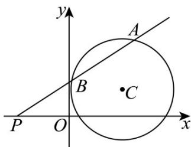

> [!faq]- 《第二章_直线和圆的方程_高效培优讲义_》官方解析
>
> > [!success]- **【答案】** (1) $x^{2}+y^{2}-4x-2y+1=0$ (2)13
>
> > [!note]- **【解析】**
> > （1）由 $\left(k + 2\right)x - \left(k + 1\right)y - k - 3 = 0\left(k \in \mathbf{R}\right)$ 可得 $k(x - y - 1) + (2x - y - 3) = 0$
> >
> > 当 $\left\{\begin{aligned}x-y-1&=0\\ 2x-y-3&=0\end{aligned}\right.$ 时，解得 x=2,y=1 ，故直线恒过定点 $C(2,1)$
> >
> > 所以圆心 $C(2,1)$ 到切线 $3x+4y-20=0$ 的距离 $d=\frac{|6+4-20|}{\sqrt{3^{2}+4^{2}}}=\frac{10}{5}=2$ ，即圆的半径为2，
> >
> > 所以圆的方程为： $\left(x - 2\right)^2 +\left(y - 1\right)^2 = 4$ ，故圆的一般方程为 $x^{2} + y^{2} - 4x - 2y + 1 = 0$
> >
> > (2) 点 $P(-2,0)$ 到圆心 $C$ 的距离 $\left|PC\right| = \sqrt{(2 + 2)^2 + 1^2} = \sqrt{17} > 2$ ，故点 $P$ 在圆外，
> >
> > 如图，
> >
> > 
> >
> > 过点 $P(-2,0)$ 的直线与圆 $C$ 相交时斜率存在，故设过点 $P$ 的直线方程为 $y = k(x + 2)$ ，代入圆的方程可得 $\left(1 + k^2\right)x^2 + \left(4k^2 - 2k - 4\right)x + 4k^2 - 4k + 1 = 0$ 当 $\Delta = (4k^2 - 2k - 4)^2 - 4(1 + k^2)(4k^2 - 4k + 1) > 0$ 时，设 $A(x_1, y_1), B(x_2, y_2)$ ，则 $x_1 + x_2 = \frac{4 - 4k^2 + 2k}{1 + k^2}, x_1x_2 = \frac{4k^2 - 4k + 1}{1 + k^2}$ ，所以 $|PA| \cdot |PB| = \sqrt{1 + k^2} |x_1 + 2| \cdot \sqrt{1 + k^2} |x_2 + 2|$ $= (1 + k^2)|x_1x_2 + 2(x_1 + x_2) + 4|$ $= (1 + k^2)\left|\frac{4k^2 - 4k + 1}{1 + k^2} + 2 \times \frac{4 - 4k^2 + 2k}{1 + k^2} + 4\right|$ $= |4k^2 - 4k + 1 + 8 - 8k^2 + 4k + 4 + 4k^2| = 13$ 即 $|PA| \cdot |PB|$ 为定值13.
