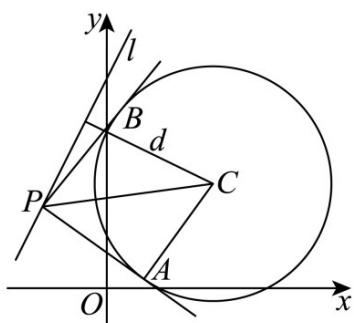

> [!faq]- 《第二章_直线和圆的方程_高效培优讲义_》官方解析
>
> > [!success]- **【答案】** (1) $(x-2)^{2}+(y-2)^{2}=5$ (2) $P(\frac{6}{5},\frac{32}{5})$ 或 $P(-2,0)$ (3) $\left[-\frac{77}{90},+\infty\right)$
>
> > [!note]- **【解析】**
> > （1）依题意，当 $y = 0$ 时，圆 $C$ 过点 $(1,0),(3,0)$ ，当 $x = 0$ 时，圆 $C$ 过点 $(0,3)$
> >
> > 设圆 C 的一般式方程为 $x^{2} + y^{2} + Dx + Ey + F = 0 (D^{2} + E^{2} - 4F > 0)$
> >
> > 则 $\left\{ \begin{array}{l} 1 + D + F = 0 \\ 9 + 3D + F = 0 \\ 9 + 3E + F = 0 \end{array} \right.$ ，解得 $\left\{ \begin{array}{l} D = -4 \\ E = -4 \\ F = 3 \end{array} \right.$ ，因此 $x^{2} + y^{2} - 4x - 4y + 3 = 0$ ，
> >
> > 所以圆 C 的标准方程为 $(x-2)^{2}+(y-2)^{2}=5$ .
> >
> > (2) 由 (1) 知，圆 $C$ 的圆心 $C(2,2)$ ，半径为 $\sqrt{5}$ ，
> >
> > 由 $\triangle PAB$ 为正三角形，得 $\angle CPA = 30^{\circ},\sin \angle CPA = \frac{1}{2} = \frac{|CA|}{|CP|} = \frac{\sqrt{5}}{CP}$ ，解得 $|CP| = 2\sqrt{5}$
> >
> > 设 $P(a,2a + 4)$ ，则 $\left|CP\right| = \sqrt{(a - 2)^2 + (2a + 4 - 2)^2} = 2\sqrt{5}$ ，解得 $a = \frac{6}{5}$ 或 $a = -2$
> >
> > 所以点 $P$ 的坐标为 $P(\frac{6}{5}, \frac{32}{5})$ 或 $P(-2, 0)$ .
> >
> > (3) 圆心 $C(2,2)$ 到直线 $l: y = 2x + 4$ 的距离 $d = \frac{|4 + 4 - 2|}{\sqrt{2^2 + 1}} = \frac{6\sqrt{5}}{5}$ ，设 $|PA| = t, \angle APC = \theta$ ， $t = \sqrt{|PC|^2 - (\sqrt{5})^2} \quad \sqrt{d^2 - 5} = \frac{\sqrt{55}}{5}$ ，则 $\cos \theta = \frac{|PA|}{|CP|} = \frac{t}{\sqrt{t^2 + 5}}$ ，
> >
> > $\overrightarrow{PA} \cdot \overrightarrow{PB} = |\overrightarrow{PA}| |\overrightarrow{PB} | \cos 2\theta = t^2 (2\cos^2\theta - 1) = t^2 [2(\frac{t}{\sqrt{t^2 + 5}})^2 - 1] = t^2 (\frac{2t^2}{t^2 + 5} - 1) = t^2 \cdot \frac{t^2 - 5}{t^2 + 5}$
> >
> > 设 $m = t^{2} + 5(m \quad \frac{36}{5})$ ，则 $t^{2} = m - 5$ ， $PA \cdot PB = \frac{(m - 5)(m - 10)}{m} = m + \frac{50}{m} - 15$ ，
> >
> > 函数 $f(m) = m + \frac{50}{m} - 15$ 在 $\left[\frac{36}{5}, +\infty\right)$ 上单调递增， $f(m) = f\left(\frac{36}{5}\right) = \frac{36}{5} + \frac{125}{18} - 15 = -\frac{77}{90}$ ，所以 $\frac{\sqrt{4}}{PA} \cdot \frac{\sqrt{4}}{PB}$ 的取值范围为 $\left[-\frac{77}{90}, +\infty\right)$ .
> >
> > 
