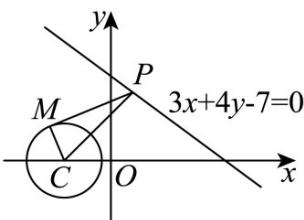

## 题型07 圆的切线问题

【典例1】已知点 $P$ 是直线 $l:3x + 4y - 7 = 0$ 上的动点，过点 $P$ 引圆 $C:(x + 1)^2 +y^2 = r^2 (r > 0)$ 的两条切线 $PM$ ， $PN,M,N$ 为切点，当 $\angle MPN$ 的最大值为 $\frac{\pi}{3}$ 时， $r$ 的值为（）A.1 B. $\sqrt{2}$ C. $\frac{3}{2}$ D.2

【答案】A

【详解】

如图 $MC = r$ ， $\sin \angle MPC = \frac{r}{PC}$ ，当 $\angle MPN$ 的最大值为 $\frac{\pi}{3}$ 时， $\angle MPC = \frac{\pi}{6}$

当 $PC \perp l$ 时，PC 最小时， $\angle MPC = \frac{\pi}{6}$ 最大.

由题得 $PC_{\min}=d=\frac{|3\times(-1)+4\times0-7|}{\sqrt{3^{2}+4^{2}}}=2$ ，所以 $\sin\angle MPC=\frac{r}{PC}=\frac{1}{2}$ ，则 r=1；

故选：A.

【典例2】过点 $(-1,0)$ 作直线 $l$ 与圆 $(x - 2)^2 +(y - 1)^2 = 1$ 相切，斜率的最大值为 $M$ ，若 $a + b = M$ ， $a > 0$ ， $b > 0$ 则 $\frac{1}{a} +\frac{4}{b}$ 的最小值是（）A.12 B.9 C. $\frac{27}{4}$ D. $\frac{28}{3}$

【答案】A

【详解】设直线 l 的方程为 $y = k(x + 1)$ ，圆心 $(2,1)$ 到直线 l 的距离为 $\frac{|3k - 1|}{\sqrt{1 + k^{2}}} = 1$ ，解得 k = 0 或 $k = \frac{3}{4}$ ，
所以 $M = \frac{3}{4}$ ，所以 $a + b = \frac{3}{4}$ ，
所以 $\frac{1}{a}+\frac{4}{b}=\frac{4}{3}(a+b)\left(\frac{1}{a}+\frac{4}{b}\right)=\frac{4}{3}\left(5+\frac{b}{a}+\frac{4a}{b}\right)\quad\frac{4}{3}\left(5+2\sqrt{\frac{b}{a}\cdot\frac{4a}{b}}\right)=12.$ 当且仅当 $b=2a=\frac{1}{2}$ 时取最小值 12 故选：A.

## 方法技巧

求圆的切线方程一般有三种方法：

（1）直接法：应用常见结论，直接写出切线方程；

(2) 待定系数法；

(3) 定义法：一般地，过圆外一点可向圆作两条切线，在后两种方法中，应注意斜率不存在的情况。

![[高中/课堂同步/题库/人教A版高中数学同步讲义(2026)/03_选择性必修第一册/第二章 直线和圆的方程/讲义/第二章_直线和圆的方程_高效培优讲义_/题型07_圆的切线问题_sec_17/questions/Q00063623.md]]
![[高中/课堂同步/题库/人教A版高中数学同步讲义(2026)/03_选择性必修第一册/第二章 直线和圆的方程/讲义/第二章_直线和圆的方程_高效培优讲义_/题型07_圆的切线问题_sec_17/questions/Q00063624.md]]
![[高中/课堂同步/题库/人教A版高中数学同步讲义(2026)/03_选择性必修第一册/第二章 直线和圆的方程/讲义/第二章_直线和圆的方程_高效培优讲义_/题型07_圆的切线问题_sec_17/questions/Q00063625.md]]
