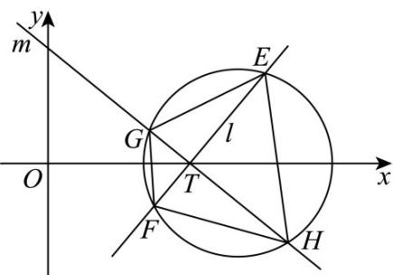
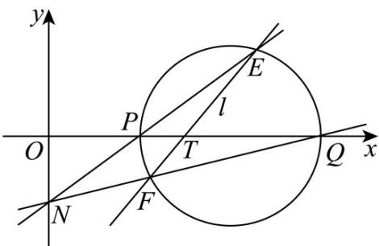

> [!faq]- 《第二章_直线和圆的方程_高效培优讲义_》官方解析
>
> > [!success]- **【答案】** (1)7 (2)是， $x = 0$
>
> > [!note]- **【解析】**
> > （1）已知圆 $C:(x - 4)^2 +y^2 = 4$ ，则圆心为 $(4,0)$ ， $r = 2$
> >
> > 
> >
> > 设直线 $l_{EF}: x = my + 3$ ，圆心到直线 $l_{EF}$ 的距离 $d = \frac{1}{\sqrt{m^2 + 1}}$
> >
> > 则 $\left|EF\right|=2\sqrt{r^{2}-d^{2}}=2\sqrt{4-\frac{1}{m^{2}+1}}$
> >
> > 直线 $l_{EF}$ 与直线 $m_{GH}$ 垂直，则直线 $m_{GH}:x = -\frac{1}{m} y + 3$
> >
> > 当 $m \neq 0$ 时， $\left|HG\right| = 2\sqrt{4 - \frac{1}{\left(-\frac{1}{m}\right)^{2} + 1}} = 2\sqrt{4 - \frac{m^{2}}{1 + m^{2}}}$
> >
> > $S = \frac{1}{2}\times 2\sqrt{4 - \frac{1}{m^2 + 1}}\times 2\sqrt{4 - \frac{m^2}{m^2 + 1}} = 2\sqrt{\left(4 - \frac{1}{m^2 + 1}\right)\left(4 - \frac{m^2}{m^2 + 1}\right)}\leq 4 - \frac{1}{m^2 + 1} +4 - \frac{m^2}{m^2 + 1} = 7$ 当且仅当 $m = \pm 1$ 时 $S$
> >
> > 取到最大值 7.
> >
> > 当 $m = 0$ 时， $\left|EF\right| = 2\sqrt{3}$ ， $\left|HG\right| = 4$ ，∴ $S = 4\sqrt{3} < 7$
> >
> > 综上，当 $m = \pm 1$ 时 S 取到最大值 7.
> >
> > (2)
> >
> > 
> >
> > 设 $E(x_{1},y_{1}), F(x_{2},y_{2})$ ，记 $P(2,0)$ ， $Q(6,0)$ ，直线 $l_{EF}: x = my + 3$ ，
> >
> > 联立直线和圆 $\left\{ \begin{array}{l} x = my + 3 \\ (x - 4)^2 + y^2 = 4 \end{array} \right.$ ，得 $\left(m^2 + 1\right)y^2 - 2my - 3 = 0$
> >
> > $\Delta>0$ 恒成立， $y_{1}+y_{2}=\frac{2m}{m^{2}+1}$ ， $y_{1}y_{2}=\frac{-3}{m^{2}+1}$ ， $y_{1}y_{2}=-\frac{3}{2m}(y_{1}+y_{2})$
> >
> > $PE: y = \frac{y_{1}}{x_{1} - 2}(x - 2), QF: y = \frac{y_{2}}{x_{2} - 6}(x - 6)$ 可得直线
> >
> > $\therefore \frac{x - 6}{x - 2} = \frac{y_1(x_2 - 6)}{y_2(x_1 - 2)} = \frac{my_1y_2 - 3y_1}{my_1y_2 + y_2} = \frac{-\frac{3}{2}(y_1 + y_2) - 3y_1}{-\frac{3}{2}(y_1 + y_2) + y_2} = 3$ ，解得 $x = 0$
> >
> > 所以点 N 恒在定直线 x = 0
