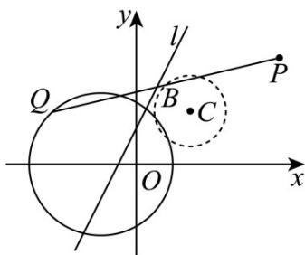

> [!faq]- 《第二章_直线和圆的方程_高效培优讲义_》官方解析
>
> > [!success]- **【答案】** (1) $(x-\frac{3}{2})^{2}+(y-\frac{3}{2})^{2}=1$ (2)相离，理由见解析.
>
> > [!note]- **【解析】**
> > （1）令 $M(m,n)$ 为线段 $PQ$ 的中点，又 $P(4,3)$ ，则 $Q(2m - 4,2n - 3)$
> >
> > 又 $Q$ 在圆 $(x + 1)^2 + y^2 = 4$ 上运动，故 $(2m - 3)^2 + (2n - 3)^2 = 4$
> >
> > 所以 $(m - \frac{3}{2})^2 +(n - \frac{3}{2})^2 = 1$ ，故点 $M$ 的轨迹方程为 $(x - \frac{3}{2})^2 +(y - \frac{3}{2})^2 = 1$
> >
> > (2)
> >
> > 
> >
> > 由（1）知圆心 $C\left(\frac{3}{2}, \frac{3}{2}\right)$ ，且半径 $r = 1$ ，
> >
> > 所以圆心到 $2x - y + 1 = 0$ 的距离 $d = \frac{|3 - \frac{3}{2} + 1|}{\sqrt{4 + 1}} = \frac{\sqrt{5}}{2} > r$
> >
> > 所以直线 l 与曲线 C 相离.
