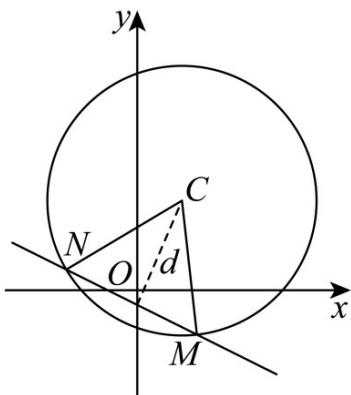

> [!faq]- 《第二章_直线和圆的方程_高效培优讲义_》官方解析
>
> > [!success]- **【答案】** (1) $(x-1)^{2}+(y-2)^{2}=9$ (2) $\triangle CMN$ 的面积的取值范围为 $(0,2\sqrt{5})$
>
> > [!note]- **【解析】**
> > （1）设圆的方程为 $x^{2} + y^{2} + Dx + Ey + F = 0$
> >
> > 因为点 $A(1,5), B(-2,2)$ 在圆上，圆心 C 在直线 $x - y + 1 = 0$ 上，
> >
> > 所以 $\left\{ \begin{array}{ll}1 + 25 + D + 5E + F = 0\\ 4 + 4 - 2D + 2E + F = 0\\ -\frac{D}{2} -(-\frac{E}{2}) + 1 = 0 \end{array} \right.$ ，解得 ， ， ， ，所以圆的方程为 $x^{2} + y^{2} - 2x - 4y - 4 = 0$ ，即 $(x - 1)^{2} + (y - 2)^{2} = 9$
> >
> > (2) 设所求直线 l 方程为 $y = -\frac{1}{2}x + m$ ，且 m < 0，即 $x + 2y - 2m = 0$ ，
> >
> > 
> >
> > 由圆心 C 到直线 l 的距离为 $d=\frac{\left|1+2\times2-2m\right|}{\sqrt{1^{2}+2^{2}}}=\frac{\left|5-2m\right|}{\sqrt{5}}$ ，所以
> >
> > 由垂径定理有 $(\frac{1}{2} |MN|)^2 +d^2 = R^2\Rightarrow \left|M N\right|^2 = 4(9 - d^2)$
> >
> > 由于 $m < 0$ ，且直线 $l$ 与圆交于两点，因此 $d > \sqrt{5}$ ，又 $0 < d < 3$ ，即 $\sqrt{5} < d < 3$
> >
> > 所以 $S_{\triangle CMN} = \frac{1}{2}\left|MN\right|\times d = \frac{1}{2}\times \sqrt{4(9 - d^2)}\times d = \sqrt{(9 - d^2)\times d^2} = \sqrt{-(d^2 - \frac{9}{2})^2 + \frac{81}{4}}$
> >
> > 由于 $\sqrt{5} < d < 3$ ，则 $d^{2} \in (5, 9)$ ，因此 $S_{\triangle CMN} \in (0, 2\sqrt{5})$
> >
> > 所以 $\triangle CMN$ 的取值范围为 $(0,2\sqrt{5})$
