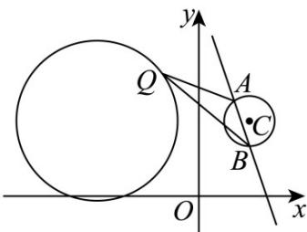
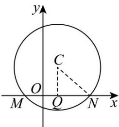
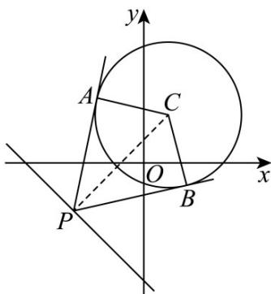

## 题型11 与圆有关的最值问题

【典例1】一个圆 $M$ 切直线 $l_{1}:x - 6y - 10 = 0$ 于点 $P(4, - 1)$ ，且圆心在直线 $l_{2}:5x - 3y = 0$ 上.

(1)求该圆的方程；

(2)过直线 $l:5x + 7y + 24 = 0$ 上一点 $N$ 引圆的两条切线，切点分别为A，B，求四边形MANB面积的最小值.

【答案】(1) $(x-3)^{2}+(y-5)^{2}=37$

(2)37

【详解】（1）设圆心坐标为 $(x,y)$ ，

则设过 $P$ 点的半径所在的直线为 $6x + y + c = 0$ ，代入 $P(4, - 1)$ ，可得 $c = -23$

由 $\left\{\begin{aligned}6x+y-23=0\\ 5x-3y=0\end{aligned}\right.$ 解得 $\left\{\begin{aligned}x=3\\ y=5'\end{aligned}\right.$ 所以 $M(3,5)$ .

所以 $r^2 = (4 - 3)^2 + (-1 - 5)^2 = 37$

所以圆的方程为 $\left(x-3\right)^{2}+\left(y-5\right)^{2}=37$

(2) 因为 $M(3,5)$ 到直线 $l:5x+7y+24=0$ 的距离为 $d=\frac{|15+35+24|}{\sqrt{5^{2}+7^{2}}}=\sqrt{74}>\sqrt{37}=r$

所以直线 $l:5x+7y+24=0$ 与圆 M 相离，

由题意四边形 $MANB$ 面积为 $2S_{\triangle MNA} = 2 \times \frac{1}{2} \times |AM| \times |AN| = \sqrt{37} \times |AN| = \sqrt{37} \times \sqrt{|MN|^2 - 37}$

可得，当MN与直线l垂直时， $\left|MN\right|$ 最小，四边形面积最小.

由 $\left|MN\right|_{\min}=d=\sqrt{74}$ . 所以四边形 MANB 面积的最小值为 $\sqrt{37}\times\sqrt{74-37}=37$ .

【典例2】已知圆 $C: x^2 + y^2 + ax - 6y + 12 = 0$ 关于直线 $x - y + 1 = 0$ 对称.

(1)求圆 $C$ 的标准方程；

(2)若直线 $3x + y - 8 = 0$ 与圆 $C$ 相交于A、 $B$ 两点，求 $\left|AB\right|$

(3)在（2）的前提下，若点 $Q$ 是圆 $(x + 4)^2 +(y - 3)^2 = 10$ 上的点，求 $\triangle QAB$ 面积的最大值.

【答案】(1) $\left(x-2\right)^{2}+\left(y-3\right)^{2}=1$

(2) $\frac{3\sqrt{10}}{5}$

(3) $\frac{81}{10}$

【详解】（1）圆 $C$ 的方程可化为 $\left(x + \frac{a}{2}\right)^2 + (y - 3)^2 = \frac{a^2}{4} - 3$ ，圆心为 $C\left(-\frac{a}{2}, 3\right)$

因为圆 $C: x^{2} + y^{2} + ax - 6y + 12 = 0$ 关于直线 $x - y + 1 = 0$ 对称，

则直线 $x - y + 1 = 0$ 过圆心 $C$ ，所以 $-\frac{a}{2} -3 + 1 = 0$ ，得 $a = -4$

所以圆 C 的标准方程为 $(x-2)^{2}+(y-3)^{2}=1$

(2) 由 (1) 得圆心为 $C(2,3)$ ，半径 $r = 1$ ，

又直线 $AB$ 的方程为 $3x + y - 8 = 0$

则圆心 C 到直线 AB 的距离 $d=\frac{|6+3-8|}{\sqrt{3^{2}+1^{2}}}=\frac{\sqrt{10}}{10}<1$ ，直线 AB 与圆相交，

所以 $\left|AB\right|=2\sqrt{r^{2}-d^{2}}=2\sqrt{1-d^{2}}=\frac{3\sqrt{10}}{5}$

(3) 圆 $(x+4)^{2}+(y-3)^{2}=10$ 的圆心为 $(-4,3)$ ，半径长为 $\sqrt{10}$

则点 $(-4,3)$ 到直线 $AB:3x + y - 8 = 0$ 的距离为 $\frac{|3\times(-4)+3-8|}{\sqrt{3^2 + 1^2}} = \frac{17\sqrt{10}}{10}$

所以点 $Q$ 到直线 $AB$ 距离的最大值为 $\frac{17\sqrt{10}}{10} +\sqrt{10} = \frac{27\sqrt{10}}{10}$

所以 $\triangle QAB$ 面积的最大值为 $\frac{1}{2} \times \frac{3\sqrt{10}}{5} \times \frac{27\sqrt{10}}{10} = \frac{81}{10}$ .

## 方法技巧

涉及与圆有关的最值，可借助图形性质，利用数形结合求解．一般地：

(1) 形如 $\mu = \frac{y - b}{x - a}$ 的最值问题，可转化为动直线斜率的最值问题.

(2) 形如 $t = ax + by$ 的最值问题，可转化为动直线截距的最值问题。

(3) 形如 $m = (x - a)^2 + (y - b)^2$ 的最值问题，可转化为曲线上的点到点 $(a, b)$ 的距离平方的最值问题【变式1】已知圆 $C: x^2 + y^2 - 2x - 4y + m = 0$ 被 $x$ 轴截得的弦长为 $2\sqrt{5}$ ， $P$ 点是直线 $x + y + 5 = 0$ 上的一点，过 $P$ 点作圆的两条切线，切点分别为 $\mathbf{A}$ 和 $\mathbf{B}$ .

(1)求 $m$ 的值；

(2)求四边形 PACB 面积的最小值.

【答案】(1)-4

(2) $3\sqrt{23}$

【详解】（1）

如图，设圆 $C$ 与 $x$ 轴交于 $M, N$ 两点，则 $\left|MN\right| = 2\sqrt{5}$

过点 $C$ 作 $CQ \perp MN$ 于点 $Q$ ，连接 $CN$ ，则 $\left|CQ\right| = 2, \left|QN\right| = \frac{1}{2} \left|M N\right| = \sqrt{5}$

$\therefore |CN|=\sqrt{\left(\sqrt{5}\right)^{2}+2^{2}}=3$ ，即圆 C 半径为 3，

$\therefore$ 圆 $C$ 标准方程为 $(x - 1)^2 +(y - 2)^2 = 9$ ，化为一般方程为 $x^{2} + y^{2} - 2x - 4y - 4 = 0$

$$
\therefore m = - 4
$$

(2)

如图，连接PC.

由题意得， $PA \perp AC, PB \perp BC$ ， $\triangle PAC$ 与 $\triangle PBC$ 全等，

$$
S _ {P A C B} = 2 S _ {\triangle P B C} = 2 \times \frac {1}{2} \times | P B | \times | C B | = 3 | P B | = 3 \sqrt {| C P | ^ {2} - | C B | ^ {2}} = 3 \sqrt {| C P | ^ {2} - 9}
$$

当 $|CP|$ 取最小值时，四边形PACB的面积有最小值，

$\left|CP\right|$ 的最小值为点 $C$ 到直线 $x + y + 5 = 0$ 的距离，即 $\left|CP\right|_{\min} = \frac{\left|1 + 2 + 5\right|}{\sqrt{1^2 + 1^2}} = 4\sqrt{2}$

∴四边形 PACB 的面积的最小值为 $3 \times \sqrt{\left(4\sqrt{2}\right)^{2} - 9} = 3\sqrt{23}$ .

![[高中/课堂同步/题库/人教A版高中数学同步讲义(2026)/03_选择性必修第一册/第二章 直线和圆的方程/讲义/第二章_直线和圆的方程_高效培优讲义_/题型11_与圆有关的最值问题_sec_21/questions/Q00063635.md]]
![[高中/课堂同步/题库/人教A版高中数学同步讲义(2026)/03_选择性必修第一册/第二章 直线和圆的方程/讲义/第二章_直线和圆的方程_高效培优讲义_/题型11_与圆有关的最值问题_sec_21/questions/Q00063636.md]]
