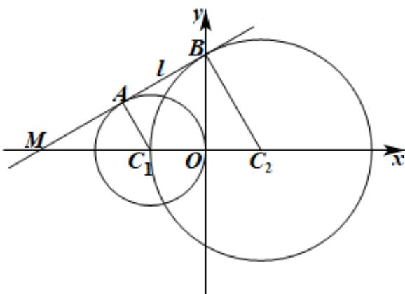

> [!faq]- 《第二章_直线和圆的方程_高效培优讲义_》官方解析
>
> > [!success]- **【答案】** C
>
> > [!note]- **【解析】**
> > 如下图所示，设直线 l 交 x 轴于点 M ，
> >
> > 
> >
> > 由于直线 l 与圆 $C_{1}:(x+1)^{2}+y^{2}=1$ ，圆 $C_{2}:(x-1)^{2}+y^{2}=4$ 都相切，切点分别为 A、B，
> > 则 $AC_{1} \perp l$ , $BC_{2} \perp l$ , $\therefore AC_{1} // BC_{2}$ ,
> > ∵ $\left|BC_{2}\right|=2=2\left|AC_{1}\right|$ , ∴ $C_{1}$ 为 $MC_{2}$ 的中点，∴ A 为 BM 的中点，∴ $\left|MC_{1}\right|=\left|C_{1}C_{2}\right|=2$
> >
> > 由勾股定理可得 $\left|AB\right|=\left|MA\right|=\sqrt{\left|MC_{1}\right|^{2}-\left|AC_{1}\right|^{2}}=\sqrt{3}$
> >
> > 故选 **C**.
