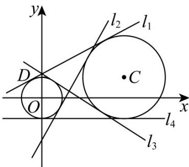

> [!faq]- 《第二章_直线和圆的方程_高效培优讲义_》官方解析
>
> > [!success]- **【答案】** (1) $(x-4)^{2}+(y-1)^{2}=4$ (2) $\frac{8}{15}$
>
> > [!note]- **【解析】**
> > （1）设圆 C 的圆心坐标为 $(a,1)$ ，半径为 r。
> >
> > 因为圆 $C$ 过点 $A(4,3)$ 和 $B(2,1)$ ，根据圆的标准方程 $(x - a)^2 + (y - 1)^2 = r^2$ .
> >
> > 对于点 $A(4,3)$ 有 $(4-a)^{2}+(3-1)^{2}=r^{2}$ ，即 $(4-a)^{2}+4=r^{2}$ ①.
> >
> > 对于点 $B(2,1)$ 有 $(2-a)^{2}+(1-1)^{2}=r^{2}$ ，即 $(2-a)^{2}=r^{2}$ ②.
> >
> > 将②代入①可得： $(4-a)^{2}+4=(2-a)^{2}$
> >
> > 展开得 $16-8a+a^{2}+4=4-4a+a^{2}$
> >
> > 移项化简得 $16+4-4=8a-4a$ ，即4a=16，解得a=4。
> >
> > 把 a = 4 代入②得 $r^{2} = (2 - 4)^{2} = 4$ .
> >
> > 所以圆 C 的标准方程为 $(x-4)^{2}+(y-1)^{2}=4$ .
> >
> > (2) 如图所示，两圆外离，公切线有四条，由于第二象限内的点 $D$ 在圆 $O$ 上显然满足题意的是 $l_{1}$ . 下面求公
> >
> > 切线斜率·显然斜率存在，设切线 $y = kx + b$
> >
> > 圆心 $O(0,0)$ 到切线 $y = kx + b$ （即 $kx - y + b = 0$ ）的距离 $d_{1} = \frac{|b|}{\sqrt{k^{2} + 1}} = 1$ （\*），
> >
> > 圆心 $C(4,1)$ 到切线 $y = kx + b$ （即 $kx - y + b = 0$ ）的距离 $d_{2} = \frac{|4k - 1 + b|}{\sqrt{k^{2} + 1}} = 2$ （\*\*），
> >
> > 两个式子比，得到由 $\frac{|b|}{|4k - 1 + b|} = \frac{1}{2}$ 化简得到 $|4k - 1 + b| = |2b|$
> >
> > 则 $4k - 1 + b = 2b$ 或者 $4k - 1 + b = -2b$ . 即 $b = 4k - 1$ 或者 $b = \frac{1 - 4k}{3}$ .
> >
> > 当 $b = 4k - 1$ 时，代入方程 $(*)$ ，得到 $|4k - 1| = \sqrt{k^2 + 1}$ ，两边平方整理得 $15k^2 - 8k = 0$ ，解得 $k = 0$ 或 $k = \frac{8}{15}$ 当 $b = \frac{1 - 4k}{3}$ 时，代入方程 $(*)$ ，同样得到 $7k^2 - 8k - 8 = 0$ ，解得 $k = \frac{4 \pm 6\sqrt{2}}{7}$
> >
> > 由于 $\frac{4 + 6\sqrt{2}}{7} >1 > \frac{8}{15}$ 且由图知道 $0 < k_{l_1} < k_{l_2}$ ，因此， $k_{l_1} = \frac{8}{15}$ .
> >
> > 故满足题意的 $l_{1}$ 的斜率为 $k_{l_{1}} = \frac{8}{15}$ .
> >
> > 
