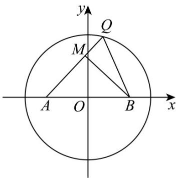

<!-- question-source:start -->
11．如图，在平面直角坐标系 $xOy$ 中，已知圆 $O: x^2 + y^2 = r^2$ 上恰有3个点到直线 $\sqrt{3} x + y + 3 = 0$ 的距离为

$\frac{3}{2}$ .设点 $A(-2,0)$ ， $B(2,0)$ ， $N(0,4)$ ，点 $Q$ 是圆 $O$ 上的任意一点，过点 $B$ 作 $BM\perp AQ$ 于 $M$ ，则下列说法

正确的是（ ）.

A. $r = 3$

B. 点 $M$ 的轨迹方程为 $x^{2} + y^{2} = 4$

C. $2|QM| + |QA|$ 的最小值为 $2\sqrt{10}$

D．圆 O 上存在唯一点 Q，使得 $\frac{3}{2}|QA| + |QN|$ 取到最小值
<!-- question-source:end -->

![[高中/课堂同步/题库/人教A版高中数学同步讲义(2026)/03_选择性必修第一册/第二章 直线和圆的方程/阶段测试/第二章_直线和圆的方程_高效培优单元测试_强化卷_/一_选择题_sec_02/questions/answers/Q00063596A1.md]]
