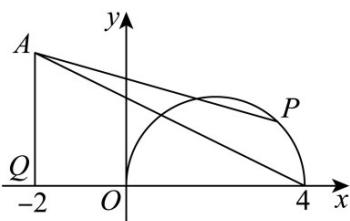

> [!faq]- 《第二章_直线和圆的方程_高效培优单元测试_强化卷_》官方解析
>
> > [!success]- **【答案】** C
>
> > [!note]- **【解析】**
> > 
> >
> > 因为 $y=\sqrt{4x-x^{2}}$ ，变形得 $(x-2)^{2}+y^{2}=4(y-0)$ ，所以 P 轨迹是以 $(2,0)$ 为圆心，以 2 为半径的圆的上半部分，
> > 如图所示，则当P与点(4,0)重合时线段 $|PA|$ 长度最大，
> > 可知当P与点 $(4,0)$ 重合时， $|AQ|=2,|PQ|=6$ ，在 $\triangle PQA$ 中根据勾股定理可知 $|PA|=\sqrt{9+36}=3\sqrt{5}$ .
> >
> > 故选 **C**.
