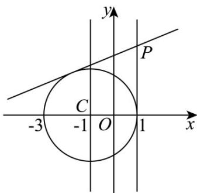

> [!faq]- 《第二章_直线和圆的方程_高效培优单元测试_强化卷_》官方解析
>
> > [!success]- **【答案】** (1) $5x - 12y + 31 = 0$ 或 $x = 1$ (2) $-2\sqrt{2}<m<2\sqrt{2}$ 且 $m\neq0$
>
> > [!note]- **【解析】**
> > （1）由题可知圆心 $C(-1,0), r = 2$
> >
> > 因为 $(1 + 1)^{2} + 3^{2} > 4$
> >
> > 所以 P 在圆外，过圆外一点作圆的切线有 $^{2}$ 条.
> >
> > 
> > - **①**：当 k 存在时，设切线方程 l ： $y-3=k(x-1)$ ，即 $kx-y-k+3=0$ 。
> >
> > 则圆心 C 到 l 的距离 $d = \frac{|-k - k + 3|}{\sqrt{1 + k^{2}}} = 2$ ，∴ $k = \frac{5}{12}$
> >
> > 此时切线 l : 5x - 12y + 31 = 0
> > - **②**：当 k 不存在时，过点 $P(1,3)$ 的直线方程为 x=1 ，
> >
> > 圆心 $C(-1,0)$ 到直线 x=1 的距离为 2，
> >
> > 所以直线 x=1 与圆 $(x+1)^{2}+y^{2}=4$ 相切，
> >
> > 此时切线方程 l : x = 1
> >
> > 综上：切线 $l$ 的方程为： $5x - 12y + 31 = 0$ 或 $x = 1$
> >
> > (2) 圆心 $C(-1,0)$ 到 l 的距离 $d=\frac{3}{\sqrt{1+m^{2}}}$
> >
> > 当圆上有 $^{1}$ 个点到l的距离为1，则 $d = r + 1 = 2 + 1 = 3,$
> >
> > 当圆上有 $^{3}$ 个点到l的距离为1，则d=r-1=2-1=1
> >
> > 所以当圆上有 $^2$ 个点到 $l$ 的距离为 $^1$ ，则 $|d - r| = |d - 2| < 1$
> >
> > 所以 $1 < d < 3$ ，即， $1 < \frac{3}{\sqrt{1 + m^2}} < 3$ ， $1 < \sqrt{1 + m^2} < 3$ ∴ m 的取值范围为 $-2\sqrt{2} < m < 2\sqrt{2}$ 且 $m \neq 0$
