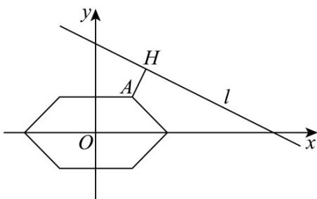

> [!faq]- 《第二章_直线和圆的方程_高效培优单元测试_提升卷_》官方解析
>
> > [!success]- **【答案】** A
>
> > [!note]- **【解析】**
> > 对于直线 $l_{1}:a^{2}x + y - 3a^{2} - 5 = 0$ ，可变形为 $a^2 (x - 3) + (y - 5) = 0$
> >
> > 令 $\left\{ \begin{array}{l}x - 3 = 0\\ y - 5 = 0 \end{array} \right.$ ，解得 $\left\{ \begin{array}{l}x = 3\\ y = 5 \end{array} \right.$ ，所以直线 $l_{1}$ 恒过定点 $A(3,5)\cdot$
> >
> > 对于直线 $l_{2}: x - a^{2}y + 3a^{2} - 5 = 0$ ，可变形为 $(x - 5) - a^{2}(y - 3) = 0$ 。
> >
> > 令 $\left\{ \begin{array}{l}x - 5 = 0\\ y - 3 = 0 \end{array} \right.$ ，解得 $\left\{ \begin{array}{l}x = 5\\ y = 3 \end{array} \right.$ ，所以直线 $l_{2}$ 恒过定点 $B(5,3)\cdot$
> >
> > 因为 $a^2 \times 1 + (-a^2) \times 1 = 0$ ，所以 $l_1 \perp l_2$ ，已知 $A(3,5)$ ， $B(5,3)$ ，则中点坐标为 $(\frac{3+5}{2}, \frac{5+3}{2}) = (4,4)$ 。
> >
> > $|AB|=\sqrt{(5-3)^{2}+(3-5)^{2}}=\sqrt{4+4}=2\sqrt{2}$ ，所以半径 $r_{1}=\frac{1}{2}|AB|=\sqrt{2}$
> >
> > 则点 $P$ 的轨迹是以 $AB$ 为直径的圆的一部分，故点 $P$ 的轨迹为 $\left(x - 4\right)^2 +\left(y - 4\right)^2 = 2\left(x > 3,y\leq 5\right)$
> >
> > 已知圆 $x^{2} + y^{2} = 2$ 的圆心 $O(0,0)$ ，半径 $r_2 = \sqrt{2}$ ，则圆心 $O(0,0)$ 与点 $P$ 轨迹圆的圆心 $(4,4)$ 的距离为 $|OC| = \sqrt{(4 - 0)^2 + (4 - 0)^2} = \sqrt{16 + 16} = 4\sqrt{2}$
> >
> > $|PQ|_{最大值为圆心加上两圆半径，即}$ $|PQ|_{max}=4\sqrt{2}+\sqrt{2}+\sqrt{2}=6\sqrt{2}$
> >
> > 由于轨迹不包含点 $(3,3)$ ，故不存在最小值·
> >
> > 故选：A.
> >
> > $$
> > P (2, 3)
> > $$
> >
> > $$
> > x ^ {2} + y ^ {2} = 8
> > $$
> >
> > $$
> > l
> > $$
> >
> > 轴交于 C，D 两点．若 $\left|AB\right|=4$ ，则 $\left|CD\right|=(\quad)$ A. $\frac{51}{5}$ B. $\frac{52}{5}$ C. $\frac{56}{5}$ D. $\frac{57}{5}$
> >
> > 【答案】B
> >
> > 【详解】可设直线 $l$ 的方程为 $y - 3 = k(x - 2)$ ，即 $kx - y + 3 - 2k = 0$
> >
> > 圆心 $O$ 到 $l$ 的距离 $d = \frac{|3 - 2k|}{\sqrt{k^2 + 1}}$ ，又 $\left|AB\right| = 2\sqrt{8 - d^2} = 4$
> >
> > 所以 $d^{2}=\frac{(3-2k)^{2}}{k^{2}+1}=4$ ，解得 $k=\frac{5}{12}$
> >
> > 记直线 $l$ 的倾斜角为 $\theta$ ， $\tan \theta = \frac{5}{12}$ ， $\sin \theta = \frac{5}{13}$ ， $|CD| = \frac{|AB|}{\sin\theta} = \frac{52}{5}$
> >
> > 故选：B.
> >
> > 4．出租车几何，又称曼哈顿距离（ManhattanDistance），最早由十九世纪的赫尔曼·闵可夫斯基在研究度量几何时提出，用以标明两点在各坐标轴上的绝对差之和·设点 $A(x_{1},y_{1})$ ， $B(x_{2},y_{2})$ ，则A，B两点之间的曼哈顿距离为 $\left\| AB\right\| = \left|x_1 - x_2\right| + \left|y_1 - y_2\right|$ ·已知点 $F_{1}(-1,0)$ ， $F_{2}(1,0)$ ，动点 $P$ 满足 $\left\| PF_1\right\| +\left\| PF_2\right\| = 4$ ， $Q$ 是直线 $l:x + 2y - 5 = 0$ 上的动点，则 $\left|PQ\right|$ 的最小值为（）A. $\frac{2\sqrt{5}}{5}$ B. $\frac{\sqrt{5}}{5}$ C. $\frac{4\sqrt{5}}{5}$ D. $\frac{3\sqrt{5}}{5}$
> >
> > 【答案】A
> >
> > 【详解】由题意可知，P 的轨迹关于 x 轴对称，也关于 y 轴对称。
> > 当 $x \quad 0, y \quad 0$ 时， $\left\|PF_{1}\right\| + \left\|PF_{2}\right\| = |x + 1| + |x - 1| + 2|y| = x + 1 + |x - 1| + 2y = 4$ 即 $y=\left\{\begin{aligned}1,0\leq x\leq1,\\ 2-x,1<x\leq2.\end{aligned}\right.$
> >
> > 画出此函数的图象，并结合对称性可得点 $P$ 的轨迹是如图所示的六边形.
> >
> > 由图可知， $\left|PQ\right|$ 的最小值为图中点 $A(1,1)$ 到直线l的距离 $\left|AH\right|=\frac{\left|1+2-5\right|}{\sqrt{5}}=\frac{2\sqrt{5}}{5}$
> >
> > 故选：A
> >
> > 
