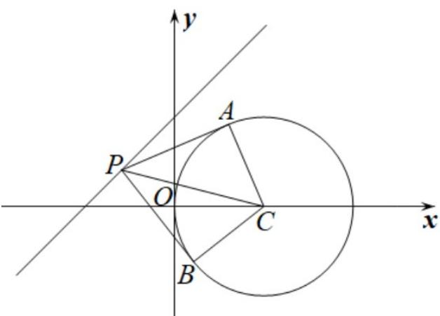

> [!faq]- 《第二章_直线和圆的方程_高效培优单元测试_提升卷_》官方解析
>
> > [!success]- **【答案】** BD
>
> > [!note]- **【解析】**
> > 对于 A，圆 $C:(x-2)^{2}+y^{2}=4$ 的圆心为 $C(2,0)$ ，半径为 2
> >
> > 由题意可得 $PA \perp AC, PB \perp BC$
> >
> > 所以 $\left|PA\right|=\sqrt{\left|PC\right|^{2}-\left|AC\right|^{2}}=\sqrt{\left|PC\right|^{2}-4}$
> >
> > $$
> > \left| P C \right| _ {\min} = \frac {\left| 2 - 0 + 2 \right|}{\sqrt {2}} = 2 \sqrt {2}
> > $$
> >
> > 所以 $\left|PA\right|_{\min}=\sqrt{\left(2\sqrt{2}\right)^{2}-4}=2$ ，故 A 错误；
> >
> > 
> >
> > 对于 B， $S_{四边形PACB}=2S_{\triangle PAC}=\left|PA\right|\cdot\left|AC\right|=2\left|PA\right|$ 4
> >
> > 所以四边形 PACB 面积的最小值为 $^{4}$ ，故 B 正确；
> >
> > 对于 C，当 $\left|PA\right|$ 最小时， $PC \perp l$ ，则直线 PC 的斜率为 -1，
> >
> > 又 $PC \perp AB$ ，所以直线 $AB$ 的斜率为 1，
> >
> > $PC$ 的直线方程为 $y - 0 = -(x - 2)$ ，即 $x + y - 2 = 0$
> >
> > 由 $\left\{\begin{aligned}x-y+2&=0\\ x+y-2&=0\end{aligned}\right.$ ，解得 x=0，y=2，即 $P(0,2)$ ，
> >
> > 因为当 $\left|PA\right|$ 最小时， $\left|PA\right|=\left|AC\right|=2$ ，所以 $\triangle APC$ 为等腰直角三角形，
> >
> > 所以 $PC$ 中点即为 $AB$ 中点，
> >
> > 因为 PC 的中点为 $(1,1)$ ，所以弦 AB 的中点为 $(1,1)$ ，
> >
> > 所以弦 AB 所在的直线方程为 y-1=x-1，即 x-y=0，故 C 错误；
> >
> > 对于 D，设 $P(t,t+2)$
> >
> > 则以 $PC$ 为直径的圆的方程为 $\left(x - 2\right)\left(x - t\right) + y\left(y - (t + 2)\right) = 0$
> >
> > 展开得 $x^{2}-(2+t)x+2t+y^{2}-(t+2)y=0$ ①，
> >
> > 圆 C 的方程为 $x^{2}-4x+4+y^{2}=4$ ，即 $x^{2}-4x+y^{2}=0$ ②，
> > - **①**：-②得弦 $AB$ 所在直线方程为 $\left(2 - t\right)x - (t + 2)y + 2t = 0$ ，即 $t(2 - x - y) + 2x - 2y = 0$
> >
> > 令 $\left\{ \begin{array}{l}2 - x - y = 0\\ 2x - 2y = 0 \end{array} \right.$ ，解得 $\left\{ \begin{array}{l}x = 1\\ y = 1 \end{array} \right.$
> >
> > 所以弦 $AB$ 所在直线必过定点 $(1,1)$ ，故 $\mathsf{D}$ 正确；
> >
> > 故选 **BD**.
