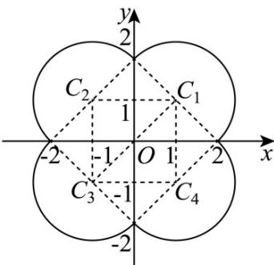

> [!faq]- 《第二章_直线和圆的方程_高效培优单元测试_提升卷_》官方解析
>
> > [!success]- **【答案】** BCD
>
> > [!note]- **【解析】**
> > 由 $x^{2} + y^{2} = 2|x| + 2|y|$ ，得 $\left(|x| - 1\right)^{2} + \left(|y| - 1\right)^{2} = 2$ ，易知曲线 $E$ 位于四个象限的图象分别是以 $C_{1}(1,1)$ ， $C_{2}(-1,1)$ ， $C_{3}(-1,-1)$ ， $C_{4}(1,-1)$ 为圆心， $\sqrt{2}$ 为半径的半圆弧，如图所示。
> >
> > 
> >
> > 选项 A：曲线 E 围成图形的面积为 $\left(2\sqrt{2}\right)^{2} + 2 \times \pi \times \left(\sqrt{2}\right)^{2} = 4\pi + 8$ ，（提示：通过观察图形，可得曲线 E 围成
> > 的图形由一个边长为 $2\sqrt{2}$ 的正方形和四个半径均为 $\sqrt{2}$ 的半圆组成）
> >
> > 故 $^{A}$ 错误；
> >
> > 选项 B：若直线 $y = x + m$ 与曲线 E 在第四象限相切，则 m < -2， $\frac{|1 - (-1) + m|}{\sqrt{2}} = \sqrt{2}$ ，（提示：直线$y = x + m$ 与曲线 E 在第四象限相切，即直线 $y = x + m$ 与圆心为 $C_{4}(1, -1)$ ，半径为 $\sqrt{2}$ 的圆在第四象限相切）
> >
> > 得 $m = -4$ ，由对称性可得直线 $y = x + m$ 与曲线 $E$ 在第二象限相切时， $m = 4$ ，数形结合可知若曲线 $E$ 与直
> >
> > 线 $y = x + m$ 有公共点，则 $-4 \leq m \leq 4$ ，故 $\mathsf{B}$ 正确；
> >
> > 选项 C：连接 $C_{1}C_{3}$ ，则曲线 E 上任意两点之间距离的最大值为 $\left|C_{1}C_{3}\right|+2\sqrt{2}=4\sqrt{2}$ ，故 C 正确；
> >
> > 选项D：若圆 $x^{2} + y^{2} = r^{2}(r > 0)$ 能完全包围曲线 $E$ ，则 $r$ 的最小值为 $2\sqrt{2}$ ，D正确·
> >
> > 故选 **BCD**
