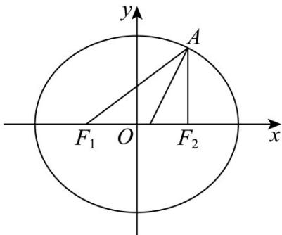

## 一、选择题：本题共8小题，每小题5分，共40分。在每小题给出的四个选项中，只有一项是符合题目要求的。

1. 将圆 $C: x^2 + y^2 = 4$ 通过纵向压缩得到一个焦点在 $x$ 轴上的椭圆，使其过点 $A\left(1, \frac{3}{2}\right)$ ，左、右焦点分别为

$F_{1}, F_{2}$ 则 $\angle F_{1}AF_{2}$ 的平分线所在直线的方程为（ ）A $4x - 2y - 1 = 0$ B $x - 2y + 2 = 0$ C $4x + 2y - 7 = 0$ D $5x - 2y - 2 = 0$

【答案】A

【详解】由题可知，压缩得到的椭圆长半轴长为2，设椭圆方程为 $\frac{x^2}{4} +\frac{y^2}{b^2} = 1$ 因为椭圆经过点 $A\left(1,\frac{3}{2}\right)$ ，所以 $\frac{1}{4} +\frac{9}{4b^2} = 1$ ，解得 $b^{2} = 3$ ，所以 $c = \sqrt{4 - 3} = 1$ 所以 $F_{1}(-1,0)$ 、 $F_{2}(1,0)$ ，则 $AF_{2}\bot F_{1}F_{2}$ ，所以 $\tan \angle F_1AF_2 = \frac{|F_1F_2|}{|AF_2|} = \frac{4}{3}$ 记 $\angle F_1AF_2$ 的平分线所在直线的倾斜角为 $\alpha$ ，则 $\alpha = \frac{\pi}{2} -\frac{1}{2}\angle F_1AF_2$ 所以 $\tan \alpha = \tan \left(\frac{\pi}{2} -\frac{1}{2}\angle F_1AF_2\right) = \frac{1}{\tan\frac{1}{2}\angle F_1AF_2}$ 又 $\tan \angle F_1AF_2 = \frac{2\tan\frac{1}{2}\angle F_1AF}{1 - \tan^2\frac{1}{2}\angle F_1AF} = \frac{4}{3}$ ，解得 $\tan \frac{1}{2}\angle F_1AF = \frac{1}{2}$ 或 $\tan \frac{1}{2}\angle F_1AF = -2$ （舍去），所以 $\tan \alpha = 2$ ，由点斜式方程得 $y - \frac{3}{2} = 2(x - 1)$ ，即 $4x - 2y - 1 = 0.$

故选：A

![[高中/课堂同步/题库/人教A版高中数学同步讲义(2026)/03_选择性必修第一册/第二章 直线和圆的方程/阶段测试/第二章_直线和圆的方程_高效培优单元测试_提升卷_/一_选择题_sec_02/questions/Q00063652.md]]
![[高中/课堂同步/题库/人教A版高中数学同步讲义(2026)/03_选择性必修第一册/第二章 直线和圆的方程/阶段测试/第二章_直线和圆的方程_高效培优单元测试_提升卷_/一_选择题_sec_02/questions/Q00063653.md]]
![[高中/课堂同步/题库/人教A版高中数学同步讲义(2026)/03_选择性必修第一册/第二章 直线和圆的方程/阶段测试/第二章_直线和圆的方程_高效培优单元测试_提升卷_/一_选择题_sec_02/questions/Q00063654.md]]
![[高中/课堂同步/题库/人教A版高中数学同步讲义(2026)/03_选择性必修第一册/第二章 直线和圆的方程/阶段测试/第二章_直线和圆的方程_高效培优单元测试_提升卷_/一_选择题_sec_02/questions/Q00063655.md]]
![[高中/课堂同步/题库/人教A版高中数学同步讲义(2026)/03_选择性必修第一册/第二章 直线和圆的方程/阶段测试/第二章_直线和圆的方程_高效培优单元测试_提升卷_/一_选择题_sec_02/questions/Q00063656.md]]
![[高中/课堂同步/题库/人教A版高中数学同步讲义(2026)/03_选择性必修第一册/第二章 直线和圆的方程/阶段测试/第二章_直线和圆的方程_高效培优单元测试_提升卷_/一_选择题_sec_02/questions/Q00063657.md]]
![[高中/课堂同步/题库/人教A版高中数学同步讲义(2026)/03_选择性必修第一册/第二章 直线和圆的方程/阶段测试/第二章_直线和圆的方程_高效培优单元测试_提升卷_/一_选择题_sec_02/questions/Q00063658.md]]
![[高中/课堂同步/题库/人教A版高中数学同步讲义(2026)/03_选择性必修第一册/第二章 直线和圆的方程/阶段测试/第二章_直线和圆的方程_高效培优单元测试_提升卷_/一_选择题_sec_02/questions/Q00063659.md]]
