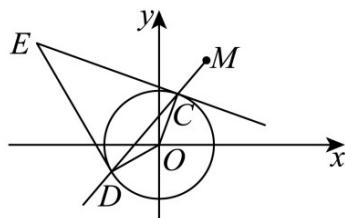

> [!faq]- 《第二章_直线和圆的方程_高效培优单元测试_提升卷_》官方解析
>
> > [!success]- **【答案】** (1) x = 1 和 $x - \sqrt{3}y + 2 = 0$ ； (2)证明见解析， $x+\sqrt{3}y-1=0$ .
>
> > [!note]- **【解析】**
> > （1）当斜率不存在时，显然 $x = 1$ 与圆 $O: x^2 + y^2 = 1$ 相切；
> >
> > 当斜率存在时，设切线为 $y = k(x - 1) + \sqrt{3}$ ，由圆心到切线的距离为 $^1$ ，
> >
> > $\therefore \frac{\left|\sqrt{3} - k\right|}{\sqrt{1 + k^2}} = 1$ ，解得 $k = \frac{\sqrt{3}}{3}$ ，则 $y = \frac{\sqrt{3}}{3}(x - 1) + \sqrt{3}$ ，整理得 $x - \sqrt{3} y + 2 = 0$
> >
> > 综上，切线方程为 $x = 1$ 和 $x - \sqrt{3} y + 2 = 0$
> >
> > (2) 设 $C(x_{1},y_{1})$ , $D(x_{2},y_{2})$ , $E(x_{0},y_{0})$ , $EC=(x_{1}-x_{0},y_{1}-y_{0})$ , $OC=(x_{1},y_{1})$ ,
> >
> > ∴由 $CE \perp CO$ ，则 $x_{1}(x_{1}-x_{0}) + y_{1}(y_{1}-y_{0}) = 0$ ，即 $x_{1}^{2} - x_{1}x_{0} + y_{1}^{2} - y_{1}y_{0} = 0$ ，又 $x_{1}^{2} + y_{1}^{2} = 1$ ，故 $x_{1}x_{0} + y_{1}y_{0} = 1$ ，
> >
> > 同理 $x_{2}x_{0} + y_{2}y_{0} = 1$ ，∴直线 $CD$ 为 $x_0x + y_0y = 1$ ，又 $M$ 在 $CD$ 上，
> >
> > $\therefore x_{0} + \sqrt{3} y_{0} = 1$ ，故 $E$ 恒在直线 $x + \sqrt{3} y = 1$ 上.
> >
> > 
