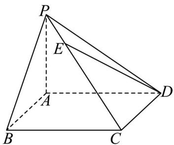

<!-- question-source:start -->
1. 在《九章算术》中，将底面为矩形且一侧棱垂直于底面的四棱锥称为阳马。如图，已知四棱锥 $P-ABCD$ 是阳马， $PA\perp$ 平面 ABCD，且 $PE=\frac{1}{4}PC$ 。若 $\overline{AB}=a$ ， $\overline{AD}=b$ ， $\overline{AP}=c$ ，则 $\overline{DE}=(\quad)$

A. $\frac{1}{4} a - \frac{3}{4} b + \frac{3}{4} c$

C. $\frac{3}{4} a + \frac{1}{4} b - \frac{3}{4} c$

B. $-\frac{3}{4}a - \frac{1}{4}b + \frac{3}{4}c$

D. $\frac{3}{4} a - \frac{1}{4} b - \frac{3}{4} c$
<!-- question-source:end -->

![[高中/课堂同步/题库/人教A版高中数学同步讲义(2026)/04_选择性必修第二册/期末/专项训练/专题01_空间向量及其运算高频题型精准突破_八大题型__高效培优期末专/_compact/answers/Q00060456A1.md]]
