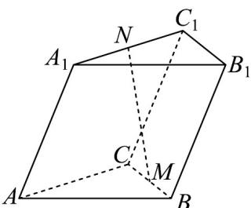

<!-- question-source:start -->
3. 如图，在斜三棱柱 $ABC - A_{1}B_{1}C_{1}$ 中， $M$ 为 $BC$ 的中点， $N$ 为 $A_{1}C_{1}$ 靠近 $A_{1}$ 的三等分点，设 $AB = a, AC = b, AA_{1} = c$ ，则用 $a, b, c$ 表示 $\overrightarrow{NM}$ 为（）

A. $\frac{1}{2} a + \frac{1}{6} b - c$ B. $-\frac{1}{2} a + \frac{1}{6} b + c$ C. $\frac{1}{2} a - \frac{1}{6} b - c$ D. $-\frac{1}{2} a - \frac{1}{6} b + c$
<!-- question-source:end -->

![[高中/课堂同步/题库/人教A版高中数学同步讲义(2026)/04_选择性必修第二册/期末/专项训练/专题01_空间向量及其运算高频题型精准突破_八大题型__高效培优期末专/_compact/answers/Q00060458A1.md]]
