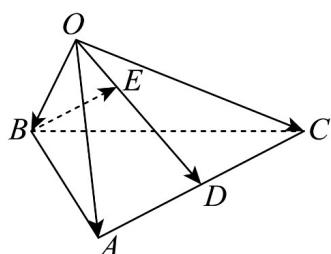

<!-- question-source:start -->
5. 如图，在四面体 $OABC$ 中， $OA = a, OB = b, OC = c$ ，点 $D$ 为 $AC$ 的中点， $\overline{OE} = \frac{1}{3} \overline{OD}$ ，则 $\overline{BE} = -$ （用 $a, b, c$ 来表示）

<!-- question-source:end -->

![[高中/课堂同步/题库/人教A版高中数学同步讲义(2026)/04_选择性必修第二册/期末/专项训练/专题01_空间向量及其运算高频题型精准突破_八大题型__高效培优期末专/_compact/answers/Q00060460A1.md]]
