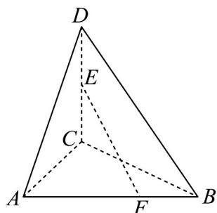

<!-- question-source:start -->
7. 如图，在三棱锥 $D - ABC$ 中， $E$ 是 $CD$ 的中点，点 $F$ 在 $AB$ 上， $\overline{AF} = \frac{2}{3} AB$ ，记 $\overline{AD} = a, AB = b, AC = c$ ，则 $\overline{EF} = (\quad)$

A. $-\frac{1}{2} a + \frac{2}{3} b + \frac{1}{2} c$ B. $-\frac{1}{2} a + \frac{2}{3} b - \frac{1}{2} c$ C. $-\frac{1}{2} a + \frac{1}{2} b + \frac{2}{3} c$ D. $\frac{1}{2} a + \frac{1}{2} b + \frac{2}{3} c$
<!-- question-source:end -->

![[高中/课堂同步/题库/人教A版高中数学同步讲义(2026)/04_选择性必修第二册/期末/专项训练/专题01_空间向量及其运算高频题型精准突破_八大题型__高效培优期末专/_compact/answers/Q00060462A1.md]]
