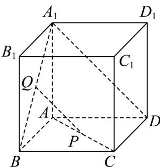

<!-- question-source:start -->
17. 如图，在棱长均为 1 的平行六面体 $ABCD - A_1B_1C_1D_1$ 中， $BB_1 \perp$ 平面 $ABCD, \angle ABC = 60^\circ$ ， $P, Q$ 分别是线段 $AC$ 和线段 $A_1B$ 上的动点，且满足 $BQ = \lambda BA_1, CP = (1 - \lambda)CA$ ，则下列说法正确的是（）

A. 当 $\lambda=\frac{1}{2}$ 时， $PQ \parallel A_{1}D$

B. 当 $\lambda = \frac{1}{2}$ 时，若 $PQ = xAB + yAD + zAA_{1}(x, y, z \in \mathbf{R})$ ，则 $x + y + z = 0$

C. 当 $\lambda = \frac{1}{3}$ 时，直线 $PQ$ 与直线 $CC_{1}$ 所成角的大小为 $\frac{\pi}{6}$

D. 当 $\lambda \in (0,1)$ 时，三棱锥 $Q - BCP$ 的体积的最大值为 $\frac{\sqrt{3}}{48}$
<!-- question-source:end -->

![[高中/课堂同步/题库/人教A版高中数学同步讲义(2026)/04_选择性必修第二册/期末/专项训练/专题01_空间向量及其运算高频题型精准突破_八大题型__高效培优期末专/_compact/answers/Q00060471A1.md]]
