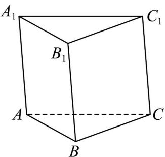

<!-- question-source:start -->
20. 如图，在三棱柱 $ABC - A_{1}B_{1}C_{1}$ 中， $P$ 为空间一点，且满足 $\overline{BP} = \lambda \overline{BC} + \mu \overline{BB}_{1}$ ， $\lambda, \mu \in [0,1]$ ，则（）

A. 当 $\lambda = 1$ 时，点 $P$ 在棱 $BB_{1}$ 上 B. 当 $\mu = 1$ 时，点 $P$ 在棱 $B_{1}C_{1}$ 上 C. 当 $\lambda +\mu = 1$ 时，点 $P$ 在线段 $B_{1}C$ 上 D. 当 $\lambda = \mu$ 时，点 $P$ 在线段 $BC_{1}$ 上
<!-- question-source:end -->

![[高中/课堂同步/题库/人教A版高中数学同步讲义(2026)/04_选择性必修第二册/期末/专项训练/专题01_空间向量及其运算高频题型精准突破_八大题型__高效培优期末专/_compact/answers/Q00060474A1.md]]
