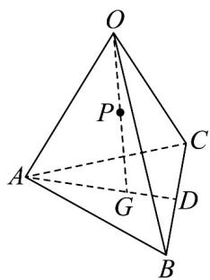

<!-- question-source:start -->
42. 如图，在四面体 $OABC$ 中， $D$ 为 $BC$ 的中点， $3AG = 2AD$ ，且 $P$ 为 $OG$ 的中点，则 $OP = (\quad)$

A. $\frac{1}{6} OA + \frac{1}{6} OB + \frac{1}{6} OC$ . - $\frac{1}{6} OA + \frac{5}{6} OB + \frac{1}{6} OC$ . $\frac{1}{3} OA + \frac{2}{3} OB - \frac{1}{6} OC$ . D. $\frac{2}{3} OA - \frac{1}{6} OB + \frac{1}{3} OC$
<!-- question-source:end -->

![[高中/课堂同步/题库/人教A版高中数学同步讲义(2026)/04_选择性必修第二册/期末/专项训练/专题01_空间向量及其运算高频题型精准突破_八大题型__高效培优期末专/_compact/answers/Q00060496A1.md]]
