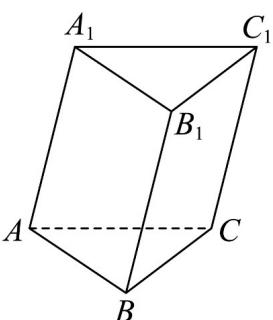

<!-- question-source:start -->
48. 如图，三棱柱 $ABC - A_{1}B_{1}C_{1}$ 中， $AB = a$ ， $AC = b$ ， $AA_{1} = c$ ，点 $M$ 为四边形 $BCC_{1}B_{1}$ 的中心点，则 $AM = (\quad)$

A. $\frac{1}{2} a + \frac{1}{2} b + \frac{1}{2} c$

B. $a + \frac{1}{2}b + \frac{1}{2}c$

C. $\frac{1}{2} a + \frac{1}{2} b - \frac{1}{2} c$

D. $a - \frac{1}{2} b - \frac{1}{2} c$
<!-- question-source:end -->

![[高中/课堂同步/题库/人教A版高中数学同步讲义(2026)/04_选择性必修第二册/期末/专项训练/专题01_空间向量及其运算高频题型精准突破_八大题型__高效培优期末专/_compact/answers/Q00060502A1.md]]
