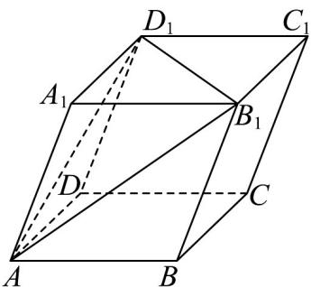

<!-- question-source:start -->
49. 如图，在平行六面体 $ABCD - A_1B_1C_1D_1$ 中， $AA_1 = AD = AB = 2$ ， $\angle BAD = \frac{\pi}{2}, \angle BAA_1 = \angle A_1AD = \frac{\pi}{3}$ ，则 $AB_1 \cdot B_1D_1 = (\quad)$

A. -8 B. 8 C. -4 D. 4
<!-- question-source:end -->

![[高中/课堂同步/题库/人教A版高中数学同步讲义(2026)/04_选择性必修第二册/期末/专项训练/专题01_空间向量及其运算高频题型精准突破_八大题型__高效培优期末专/_compact/answers/Q00060503A1.md]]
