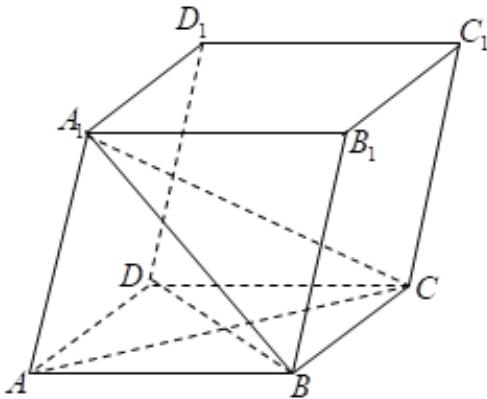

<!-- question-source:start -->
52．如图，平行六面体 $ABCD-A_{1}B_{1}C_{1}D_{1}$ ， $\angle BAD=90^{\circ}$ ， $\angle BAA_{1}=\angle DAA_{1}=60^{\circ}$ ， $AB=AD=AA_{1}=1$ ，下列说法正确的是（）

A. $\overline{AB} + \overline{AD} + \overline{AA_{1}} = \overline{AC_{1}}$ B. $\left|A_{1}C\right| = 2$ C. $\overline{A_{1}A} \cdot \overline{BD} = 0$ D. $\overline{A_{1}B} \cdot \overline{DB} = 1$
<!-- question-source:end -->

![[高中/课堂同步/题库/人教A版高中数学同步讲义(2026)/04_选择性必修第二册/期末/专项训练/专题01_空间向量及其运算高频题型精准突破_八大题型__高效培优期末专/_compact/answers/Q00060506A1.md]]
