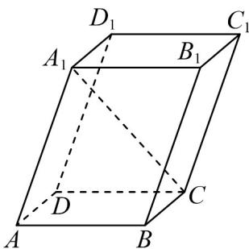

<!-- question-source:start -->
54．如图，在棱长均为 $^{1}$ 的平行六面体 $ABCD-A_{1}B_{1}C_{1}D_{1}$ 中， $\angle A_{1}AB=\angle A_{1}AD=\angle DAB=60^{\circ}$ ，则 $\left|A_{1}C\right|=$ \_\_\_\_

<!-- question-source:end -->

![[高中/课堂同步/题库/人教A版高中数学同步讲义(2026)/04_选择性必修第二册/期末/专项训练/专题01_空间向量及其运算高频题型精准突破_八大题型__高效培优期末专/_compact/answers/Q00060508A1.md]]
