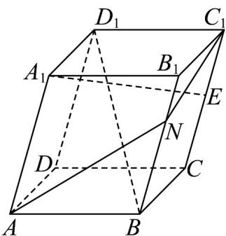

<!-- question-source:start -->
57. 在平行六面体 $ABCD - A_{1}B_{1}C_{1}D_{1}$ 中，已知 $AB = AD = AA_{1} = 1$ ， $\angle A_{1}AD = \angle A_{1}AB = \angle BAD = 60^{\circ}$ ， $E$ 为棱 $CC_{1}$ 的中点，则（）

A. $BD_{1}=\sqrt{2}$

B. 直线 $A_{1}E$ 与 $BD$ 所成的角为 $60^{\circ}$

C. $B_{1}D_{1}\perp$ 平面 $ACC_{1}A_{1}$

D．已知 N 为 $BB_{1}$ 上一点，则 $AN + NC_{1}$ 最小值为 $\sqrt{7}$
<!-- question-source:end -->

![[高中/课堂同步/题库/人教A版高中数学同步讲义(2026)/04_选择性必修第二册/期末/专项训练/专题01_空间向量及其运算高频题型精准突破_八大题型__高效培优期末专/_compact/answers/Q00060511A1.md]]
