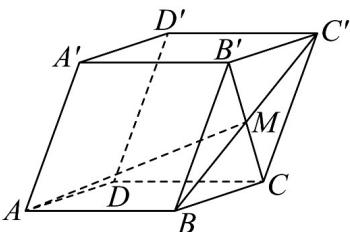

<!-- question-source:start -->
60．如图所示，在棱长均为2的平行六面体 $ABCD-A'B'C'D'$ 中， $\angle A'AB=\angle A'AD=\angle BAD=60^{\circ}$ ，点M为 $BC'$ 与 $B'C$ 的交点，则AM的长为\_\_\_\_.

<!-- question-source:end -->

![[高中/课堂同步/题库/人教A版高中数学同步讲义(2026)/04_选择性必修第二册/期末/专项训练/专题01_空间向量及其运算高频题型精准突破_八大题型__高效培优期末专/_compact/answers/Q00060514A1.md]]
