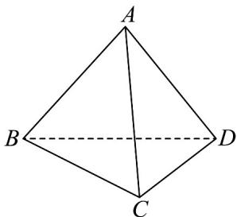

<!-- question-source:start -->
64. 如图，在四面体 $ABCD$ 中，设 $AB = a$ ， $AC = b$ ， $AD = c$ ，下列条件能证明 $AB \perp CD$ 的是（）

A. $a \cdot b = a \cdot c$

B. $\left|AB\right|=\left|CD\right|$ , $\left|AC\right|=\left|BD\right|$ , $\left|AD\right|=\left|BC\right|$

C. $\left|\overline{A}C\right|=\left|\overline{B}C\right|,\left|\overline{A}D\right|=\left|\overline{B}D\right|$

D. $AC \cdot BD = 0$ , $AD \cdot BC = 0$
<!-- question-source:end -->

![[高中/课堂同步/题库/人教A版高中数学同步讲义(2026)/04_选择性必修第二册/期末/专项训练/专题01_空间向量及其运算高频题型精准突破_八大题型__高效培优期末专/_compact/answers/Q00060517A1.md]]
