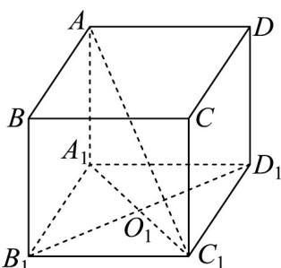
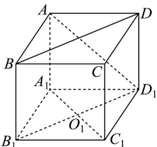
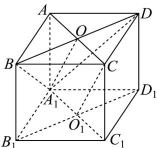
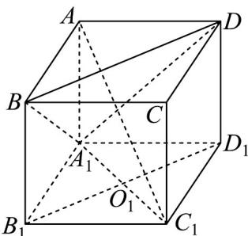

> [!faq]- 《专题01_空间向量及其运算高频题型精准突破_八大题型__高效培优期末专》官方解析
>
> > [!success]- **【答案】** AC
>
> > [!note]- **【分析】**
> > 对于选项 A，根据空间向量的线性定理进行求解即可；对于选项 B，先确定 $AD_{1}, BD$ 的夹角，然后求出其角度是否为 $90^{\circ}$ 即可；对于选项 C，要证明线面平行，需通过证明线线证明即可证明线面平行，即证明 $CO_{1} //OA_{1}$ ；对于选项 D，可利用反证法进行验证。
>
> > [!note]- **【解析】**
> > 对于选项 $^{A}$ ：如图，
> >
> > 
> >
> > 根据向量线性定理可知， $AB + AD = AC, AC + AA_{1} = AC_{1}$
> >
> > 所以 $AC_{1} = AB + AD + AA_{1}$ ，A 正确；
> >
> > 
> >
> > 因为 $BC_{1} / / AD_{1}$ ，若 $AD_{1} \perp BD$ ，则 $BC_{1} \perp BD$ ，则 $C_{1}B^{2} + BD^{2} = C_{1}D^{2}$ ，设底面边长为 $a$ ，正四棱柱的高为 $b$ ，则 $C_1B^2 = C_1D^2 = a^2 +b^2,BD^2 = 2a^2$ ，等式不成立，B错误；
> >
> > 对于选项 C :
> >
> > 连接 AC, BD 交于 O，连接 $OA_{1}$
> >
> > 
> >
> > 则 $OC / / A_{1}O_{1}, OC = A_{1}O_{1}$ ，所以四边形 $OCO_{1}A_{1}$ 为平行四边形，
> >
> > 所以 $CO_{1} //OA_{1}$ .
> >
> > 因为 $OA_{1} \subset$ 平面 $A_{1}BD$ ， $O_{1}C$ 不在平面 $A_{1}BD$ 内，
> >
> > 所以 $CO_{1}$ // 平面 $A_{1}BD$ ，所以 C 正确；
> >
> > 对于选项 D：
> >
> > 
> >
> > 因为正四棱柱 $ABCD - A_{1}B_{1}C_{1}D_{1}$ ，所以 $B_{1}D_{1}\perp A_{1}C_{1},B_{1}D_{1}\perp A_{1}A$
> >
> > 因为 $AA_{1} \cap A_{1}C_{1} = A_{1}, AA_{1}, A_{1}C_{1} \subset$ 平面 $AA_{1}C_{1}$ ，所以 $B_{1}D_{1} \perp$ 平面 $AA_{1}C_{1}$ .
> >
> > 因为 $AC_{1} \subset$ 平面 $AA_{1}C_{1}$ ，所以 $B_{1}D_{1} \perp AC_{1}$ .
> >
> > 又 $B_{1}D_{1}//BD$ ，所以 $BD\perp AC_{1}$ .
> >
> > 因为 $C_1D_1 \perp$ 平面 $AA_1D_1D$ ， $A_1D \subset$ 平面 $AA_1D_1D$ ，所以 $C_1D_1 \perp A_1D$
> >
> > 假设 $AC_{1} \perp$ 平面 $A_{1}BD$ ，因为， $A_{1}D \subset$ 平面 $A_{1}BD$
> >
> > 所以 $AC_{1} \perp A_{1}D$ .
> >
> > 又 $AC_{1} \cap C_{1}D_{1} = C_{1}, AC_{1}, C_{1}D_{1} \subset$ 平面 $AC_{1}D_{1}$ ，所以 $A_{1}D \perp$ 平面 $AC_{1}D_{1}$
> >
> > 又 $AD_{1} \subset$ 平面 $AC_{1}D_{1}$ ，所以 $AD_{1} \perp A_{1}D$ ，所以 $AA_{1} = AD$ 。
> >
> > 而在正四棱柱中， $AA_{1}, AD$ 不一定相等，所以 $AC_{1}$ 与平面 $A_{1}BD$ 不一定垂直，D错误.
> >
> > 故选 **AC**.
