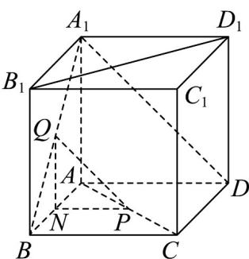

> [!faq]- 《专题01_空间向量及其运算高频题型精准突破_八大题型__高效培优期末专》官方解析
>
> > [!success]- **【答案】** ABD
>
> > [!note]- **【分析】**
> > 利用直棱柱的性质，以及空间向量的有关知识逐项计算可得结论·
>
> > [!note]- **【解析】**
> > 对于 A，当 $\lambda=\frac{1}{2}$ 时，P,Q 分别是线段 AC 和线段 $A_{1}B$ 的中点，
> >
> > 所以 P 也是 BD 的中点，所以 $PQ // A_{1}D$ ，故 A 正确；
> >
> > 对于 B，当 $\lambda=\frac{1}{2}$ 时， $PQ=\overline{AQ}-\overline{AP}=\frac{1}{2}(AB+\overline{AA}_{1})-\frac{1}{2}(AB+\overline{AD})=-\frac{1}{2}\overline{AD}+\frac{1}{2}\overline{AA}_{1}$
> >
> > 所以 $x = 0$ ， $y = -\frac{1}{2}$ ， $z = \frac{1}{2}$ ，满足 $x + y + z = 0$ ，故B正确；
> >
> > 对于 $\mathbb{C}$ ，过 $Q$ 作 $QN / / AA_{1}$ 交 $AD$ 于 $N$
> >
> > 
> >
> > 可知 $QN \perp$ 面 $ABCD$ , $PQ$ 与直线 $CC_{1}$ 成角即为 $\angle PQN$
> >
> > 当 $\lambda=\frac{1}{3}$ 时， $QN=\frac{1}{3}$ ，在 $\triangle ANP$ 中， $AN=\frac{2}{3}, AP=\frac{1}{3}, \angle PAN=60^{\circ}$
> >
> > 则 $PN = \sqrt{\left(\frac{2}{3}\right)^2 + \left(\frac{1}{3}\right)^2 - 2 \times \frac{2}{3} \times \frac{1}{3} \times \frac{1}{2}} = \frac{\sqrt{3}}{3}$
> >
> > 所以 $\tan\angle PQN=\frac{PN}{QN}=\frac{\frac{\sqrt{3}}{3}}{\frac{1}{3}}=\sqrt{3}$ ，所以 $\angle PQN=60^{\circ}$ ，故 C 错误；
> >
> > 对于 D，易知 VABC 是正三角形，
> >
> > 三棱锥 $Q - BCP$ 体积为 $V = \frac{1}{3} \times \frac{1}{2} BC \times CP \times \sin 60^{\circ} \times QN$ $= \frac{1}{3} \times \frac{1}{2} \times 1 \times (1 - \lambda) \times \sin 60^{\circ} \times \lambda = \frac{\sqrt{3}}{12}(1 - \lambda)\lambda$ $\leq \frac{\sqrt{3}}{12}\left(\frac{1 - \lambda + \lambda}{2}\right)^{2} = \frac{\sqrt{3}}{48}$ ，
> >
> > 当且仅当 $1 - \lambda = \lambda$ ，即 $\lambda = \frac{1}{2}$ 时取等号，故D正确；
> >
> > 故选 **ABD**.
