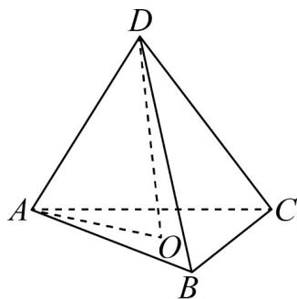

> [!faq]- 《专题01_空间向量及其运算高频题型精准突破_八大题型__高效培优期末专》官方解析
>
> > [!success]- **【答案】** B
>
> > [!note]- **【分析】**
> > 根据向量的线性运算法则，准确运算，即可求解·
>
> > [!note]- **【解析】**
> > 因为四面体 DABC 是正四面体，则每个面都是正三角形，
> >
> > $$
> > D O = D A + A O = D A + \frac {1}{3} (A B + A C) = D A + \frac {1}{3} (D B - D A + D C - D A)
> > $$
> >
> > $$
> > = \frac {1}{3} D A + \frac {1}{3} D B + \frac {1}{3} D C
> > $$
> >
> > 又由 $\overline{DO}=x\overline{DA}+y\overline{DB}+z\overline{DC}$ ，所以 x=y=z= $\frac{1}{3}$ .
> >
> > 故选：B.
> >
> > 
> >
> > ## 考点04 判定空间向量共面
