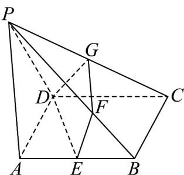

> [!faq]- 《专题01_空间向量及其运算高频题型精准突破_八大题型__高效培优期末专》官方解析
>
> > [!success]- **【答案】** A
>
> > [!note]- **【分析】**
> > 结合图形，表示出相关向量，再利用四点共面时空间向量的基本定理列方程组求解即可·
>
> > [!note]- **【解析】**
> > 
> >
> > 由题意可得 $\overline{DE}=\overline{DA}+\overline{AE}=\overline{DA}+\frac{1}{2}\overline{DC}$
> >
> > 因为 $\overline{PF}=2\overline{FB}$ ，所以 $\overline{DF}=\overline{DP}+\overline{PF}$ ，且 $\overline{PF}=\frac{2}{3}\overline{PB}$ ， $\overline{PB}=\overline{PD}+\overline{DB}$ ， $\overline{DB}=\overline{DA}+\overline{AB}=\overline{DA}+\overline{DC}$ ，
> >
> > 所以 $\overline{DF} = \overline{DP} + \frac{2}{3}\left(\overline{PD} + \overline{DA} + \overline{DC}\right) = \frac{1}{3}\overline{DP} + \frac{2}{3}\overline{DA} + \frac{2}{3}\overline{DC}$
> >
> > 因为 $\overline{PG} = \lambda \overline{GC}$ ，所以 $\overline{PG} = \frac{\lambda}{\lambda + 1} \overline{PC}$ ， $\overline{PC} = \overline{PD} + \overline{DC}$ ，
> >
> > 所以 $\overline{DG} = \overline{DP} + \frac{\lambda}{\lambda + 1}\left(\overline{PD} + \overline{DC}\right) = \frac{1}{\lambda + 1}\overline{DP} + \frac{\lambda}{\lambda + 1}\overline{DC}$
> >
> > 因为 $D, E, F, G$ 四点共面，根据空间向量四点共面的性质，有 $\overline{DG} = x\overline{DE} + y\overline{DF}$
> >
> > 所以 $\frac{1}{\lambda + 1} DP + \frac{\lambda}{\lambda + 1} DC = x\left(\frac{D}{DA} + \frac{1}{2} DC\right) + y\left(\frac{1}{3} DP + \frac{2}{3} DA + \frac{2}{3} DC\right) = \frac{y}{3} DP + \left(x + \frac{2y}{3}\right)DA + \left(\frac{x}{2} + \frac{2y}{3}\right)DC$ 所以 $\left\{ \begin{array}{l} \frac{y}{3} = \frac{1}{\lambda + 1}\\ x + \frac{2y}{3} = 0\\ \frac{x}{2} +\frac{2y}{3} = \frac{\lambda}{\lambda + 1} \end{array} \right.$ ，解得 $\left\{ \begin{array}{l}x = -1\\ y = \frac{3}{2}\\ \lambda = 1 \end{array} \right.$
> >
> > 所以 $\lambda = 1$ .
> >
> > 故选 **A**
