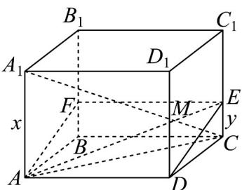

> [!faq]- 《专题01_空间向量及其运算高频题型精准突破_八大题型__高效培优期末专》官方解析
>
> > [!success]- **【答案】** $\frac{\sqrt{6} + \sqrt{2}}{2}$
>
> > [!note]- **【分析】**
> > 设 $AA_{1}=x, CE=y$ ，由 $\angle A_{1}BA + \angle A_{1}CA + \angle A_{1}DA = \frac{\pi}{2}$ 可得 $\tan\left(\angle A_{1}BA + \angle A_{1}CA\right) = \tan\left(\frac{\pi}{2} - \angle A_{1}DA\right)$ ，用 x 表示正切值，利用和角的正切公式求得 $x^{2} = \sqrt{3} - 1$ ，再由 $A_{1}M = \sqrt{3}MC$ 求得 $y^{2} = \frac{\sqrt{3} - 1}{3}$ ，利用 $AA_{1} // CC_{1}$ 构造平面 $\alpha$ ，连接 AM 并延长交 $CC_{1}$ 于点 E，连接 DE，过点 E 作 EF // BC，交 $BB_{1}$ 于点 F，即可得矩形
> >
> > DEFA 为平面 ADM 截长方体 $ABCD - A_{1}B_{1}C_{1}D_{1}$ 得到的截面，求其面积即可.
>
> > [!note]- **【解析】**
> > 已知 $BD = 2AB = 2$ ，则 $AD = \sqrt{BD^2 - AB^2} = \sqrt{3}$
> >
> > 设 $AA_{1}=x, CE=y, \tan\angle A_{1}BA=x, \tan\angle A_{1}CA=\frac{x}{2}, \tan\angle A_{1}DA=\frac{x}{\sqrt{3}}$
> >
> > 因为 $\angle A_{1}BA + \angle A_{1}CA + \angle A_{1}DA = \frac{\pi}{2}$
> >
> > $$
> > \therefore \angle A _ {1} B A + \angle A _ {1} C A = \frac {\pi}{2} - \angle A _ {1} D A
> > $$
> >
> > $\therefore \tan \left( \angle A_{1}BA + \angle A_{1}CA \right) = \tan \left( \frac{\pi}{2} - \angle A_{1}DA \right)$
> >
> > $$
> > \therefore \frac {\tan \angle A _ {1} B A + \tan \angle A _ {1} C A}{1 - \tan \angle A _ {1} B A \cdot \tan \angle A _ {1} C A} = \frac {1}{\tan \angle A _ {1} D A}
> > $$
> >
> > 所以 $\frac{x + \frac{x}{2}}{1 - \frac{x^2}{2}} = \frac{\sqrt{3}}{x}$ ，化简得 $\frac{3}{2} x^2 = \sqrt{3}(1 - \frac{x^2}{2})$ ，得 $x^{2} = \sqrt{3} -1$
> >
> > 即 $AA_{1}^{2} = \sqrt{3} - 1$
> >
> > 又 $\frac{y}{x} = \frac{CM}{MA_1} = \frac{1}{\sqrt{3}}$ ，则 $y^{2} = \frac{x^{2}}{3} = \frac{\sqrt{3} - 1}{3}$
> >
> > 因 $AA_{1} // CC_{1}$ ，则 $AA_{1}, CC_{1}$ 组成一个平面 $\alpha$ ，由 $A_{1}M = \sqrt{3}MC$ 可知在线段点M在 $A_{1}C$ 上，
> >
> > 故点 M 在平面 $\alpha$ 内，连接 AM 并延长交 $CC_{1}$ 于点 E，连接 DE，过点 E 作 EF // BC，交 $BB_{1}$ 于点 F，连接 AF，
> >
> > 则矩形 DEFA 即平面 ADM 截长方体 $ABCD - A_{1}B_{1}C_{1}D_{1}$ 得到的截面.
> >
> > 因 $DE^{2} = y^{2} + 1 = \frac{\sqrt{3} + 2}{3}$ ，即 $DE = \sqrt{\frac{2\sqrt{3} + 4}{6}} = \frac{\sqrt{3} + 1}{\sqrt{6}}$
> >
> > $S_{DEFA} = AD \cdot DE = \sqrt{3} \times \frac{\sqrt{3} + 1}{\sqrt{6}} = \frac{\sqrt{3} + 1}{\sqrt{2}} = \frac{\sqrt{6} + \sqrt{2}}{2}$ .
> >
> > 故答案为： $\frac{\sqrt{6}+\sqrt{2}}{2}$
> >
> > 
