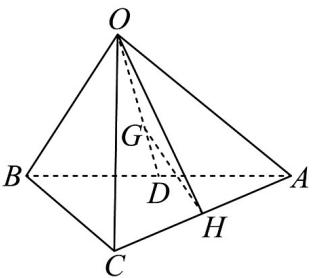

> [!faq]- 《专题01_空间向量及其运算高频题型精准突破_八大题型__高效培优期末专》官方解析
>
> > [!success]- **【答案】** A
>
> > [!note]- **【分析】**
> > 根据空间向量的线性运算可得结果·
>
> > [!note]- **【解析】**
> > 
> >
> > 如图，连接 $OH$ ，连接 $OG$ 并延长交 $AB$ 于点 $D$ ，则 $D$ 为 $AB$ 中点，且 $\square OG = \frac{2}{3} OD$
> >
> > $$
> > \therefore O G = \frac {2}{3} \cdot \frac {1}{2} \left(O A + O B\right) = \frac {1}{3} \left(\vec {a} + \vec {b}\right)
> > $$
> >
> > ∵ $_{H}$ 为AC的中点，∴ $\stackrel{\square\square}{OH}=\frac{1}{2}\left(\stackrel{\square\square}{OA}+\stackrel{\square\square}{OC}\right)=\frac{1}{2}\left(\stackrel{\rightarrow}{a+c}\right)$
> >
> > $$
> > G H = O H - O G = \frac {1}{2} (a + c) - \frac {1}{3} (a + b) = \frac {1}{6} a - \frac {1}{3} b + \frac {1}{2} c
> > $$
> >
> > 故选 **A**.
