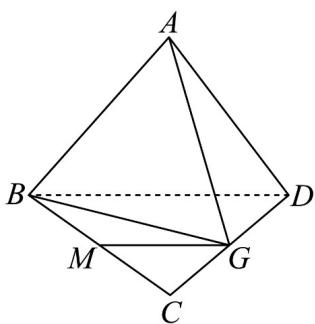

> [!faq]- 《专题01_空间向量及其运算高频题型精准突破_八大题型__高效培优期末专》官方解析
>
> > [!success]- **【答案】** C
>
> > [!note]- **【分析】**
> > 根据已知可得 $BD + BC = 2BG$ ，代入即可得出答案·
>
> > [!note]- **【解析】**
> > 
> >
> > 因为点 $G$ 是 $CD$ 的中点，
> >
> > 所以 $BD + BC = 2BG$
> >
> > 所以 $\overline{AB} + \frac{1}{2}\left(\overline{BD} + \overline{BC}\right) = \overline{AB} + \overline{BG} = \overline{AG}$ .
> >
> > 故选 **C**.
