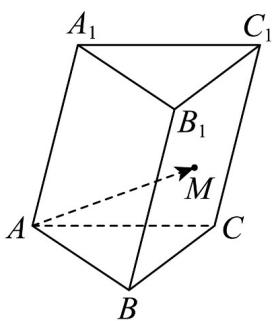

> [!faq]- 《专题01_空间向量及其运算高频题型精准突破_八大题型__高效培优期末专》官方解析
>
> > [!success]- **【答案】** A
>
> > [!note]- **【分析】**
> > 根据条件，利用空间向量的线性运算，即可求出结果·
>
> > [!note]- **【解析】**
> > 根据题意， $AM = AB + BM = AB + \frac{1}{2} BC_{1} = AB + \frac{1}{2}(BB_{1} + BC)$
> >
> > 又 $\overline{BC}=\overline{AC}-\overline{AB}$ ，所以 $\overline{AM}=\frac{1}{2}\overline{AB}+\frac{1}{2}\overline{BB}_{1}+\frac{1}{2}\overline{AC}=\frac{1}{2}\overrightarrow{a}+\frac{1}{2}\overrightarrow{b}+\frac{1}{2}c$
> >
> > 
> >
> > 故选：A.
> >
> > 考点07 求空间向量的数量积
