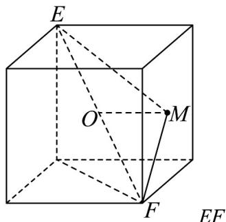

> [!faq]- 《专题01_空间向量及其运算高频题型精准突破_八大题型__高效培优期末专》官方解析
>
> > [!success]- **【答案】** C
>
> > [!note]- **【分析】**
> > 求得正方体外接球的半径，根据空间向量的数量积运算求得 $\overline{ME} \cdot \overline{MF}$ 的表达式 $\left|OM\right|^{2}-27$ ，确定 $\left|OM\right|$ 的最小值，即得答案·
>
> > [!note]- **【解析】**
> > 如图，
> >
> > 
> >
> > 是棱长为 $^{6}$ 的正方体的一条体对角线，则也是正方体外接球的一条直径，由正方
> >
> > 体的特征可得其外接球半径为 $\frac{\sqrt{6^{2}+6^{2}+6^{2}}}{2}=3\sqrt{3}$ ，设外接球球心为 O，则 $OF=-OE$ ，
> >
> > $$
> > \stackrel {\text {   }} {M E} \cdot \stackrel {\text {   }} {M F} = \left(\stackrel {\text {   }} {M O} + \stackrel {\text {   }} {O E}\right) \cdot \left(\stackrel {\text {   }} {M O} + \stackrel {\text {   }} {O F}\right) = \left(\stackrel {\text {   }} {M O} + \stackrel {\text {   }} {O E}\right) \cdot \left(\stackrel {\text {   }} {M O} - \stackrel {\text {   }} {O E}\right)
> > $$
> >
> > $$
> > = \left| M O \right| ^ {2} - \left| O E \right| ^ {2} = \left| M O \right| ^ {2} - (3 \sqrt {3}) ^ {2} = \left| O M \right| ^ {2} - 2 7
> > $$
> >
> > 由于点 $M$ 在正方体表面上运动，故 $\left|OM\right|^2$ 的最小值为球心 $O$ 与正方体面的中心连线的长，
> >
> > 即为正方体棱长的一半，为 $\frac{6}{2} = 3$ ，所以 $\overline{ME} \cdot \overline{MF}$ 的最小值为 $3^2 - 27 = -18$ .
> >
> > 故选 **C**
