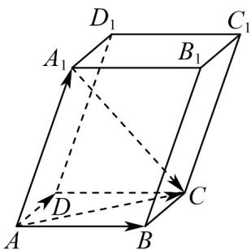

> [!faq]- 《专题01_空间向量及其运算高频题型精准突破_八大题型__高效培优期末专》官方解析
>
> > [!success]- **【答案】** $\sqrt{2}$
>
> > [!note]- **【分析】**
> > 结合图象根据向量加减法得出 $A_{1}C$ 的表达式，根据向量模长公式得出 $\left|A_{1}C\right|$ 的表达式，再根据平行六面体的性质结合已知条件计算得出相应的向量数量积与模长值，最后代入 $\left|A_{1}C\right|$ 的表达式求解。
>
> > [!note]- **【解析】**
> > 如下图所示：
> >
> > 
> >
> > $$
> > \because \stackrel {{\text {   }}} {{A}} _ {1} C = \stackrel {{\text {   }}} {{A}} C - \stackrel {{\text {   }}} {{A}} A _ {1} = D C + \stackrel {{\text {   }}} {{A}} D - \stackrel {{\text {   }}} {{A}} A _ {1} = \stackrel {{\text {   }}} {{A}} B + \stackrel {{\text {   }}} {{A}} D - \stackrel {{\text {   }}} {{A}} A _ {1}
> > $$
> >
> > $$
> > \therefore \left| A _ {1} C \right| = \sqrt {\left(A B + A D - A A _ {1}\right) ^ {2}} = \sqrt {\left| A B \right| ^ {2} + \left| A D \right| ^ {2} + \left| A A _ {1} \right| ^ {2} + 2 A B \cdot A D - 2 A B \cdot A A _ {1} - 2 A D \cdot A A _ {1}}
> > $$
> >
> > ∵ 平行六面体棱长均为 $^{1}$ ,
> >
> > $$
> > \therefore \left| \stackrel {{\sqcup \sqcup \sqcup}} {A D} \right| = \left| \stackrel {{\sqcup \sqcup \sqcup}} {A B} \right| = \left| \stackrel {{\sqcup \sqcup \sqcup}} {A A _ {1}} \right| = 1
> > $$
> >
> > 又∵ $\angle A_{1}AB = \angle A_{1}AD = \angle DAB = 60^{\circ}$
> >
> > $$
> > \therefore A B \cdot A D = \left| A B \right| \cdot \left| A D \right| \cdot \cos 6 0 ^ {\circ} = \frac {1}{2}, \quad A B \cdot A A _ {1} = \left| A B \right| \cdot \left| A A _ {1} \right| \cdot \cos 6 0 ^ {\circ} = \frac {1}{2}, \quad A D \cdot A A _ {1} = \left| A D \right| \cdot \left| A A _ {1} \right| \cdot \cos 6 0 ^ {\circ} = \frac {1}{2}
> > $$
> >
> > $$
> > \therefore \left| A _ {1} C \right| = \sqrt {1 ^ {2} + 1 ^ {2} + 1 ^ {2} + 2 \times \frac {1}{2} - 2 \times \frac {1}{2} - 2 \times \frac {1}{2}} = \sqrt {2}
> > $$
> >
> > 故答案为： $\sqrt{2}$
